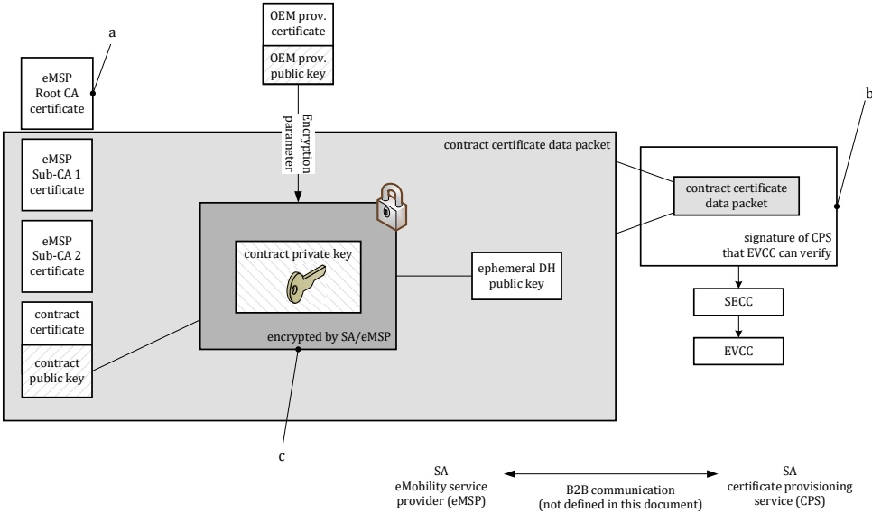

Key

This is the root certificate which the eMSP uses to derive the contract certificate. The root does not need to be present in the EVCC but the CPS needs to handle it according to well established guidelines.

b The signature of the CPS ensures that the data are authentic.

Encrypted with AES in GCM mode (with authentication tag) based on ECDH shared secret with input coming from the public key of OEM provisioning certificate.

## Figure 15 — Process for CertificateInstallationRes

Private keys belonging to contract certificates need to be protected (i.e. encrypted) when distributed from the SA (eMSP) to the EVCC. This subclause (and the subclauses within) describes how the contract certificate private key is encrypted and decrypted for installation in an EVCC that does not contain TPM 2.0.

If the EVCC contains a TPM 2.0, 7.9.2.5.3 (and its subclauses) applies instead.

7.9.2.5.2.1 Common requirements for contract certificate private key encryption/decryption mechanism for EVCC without TPM 2.0

[V2G20-2491] Each V2G entity shall have mechanisms to process ECDHE Key exchange. Public parameters are derived from the public ECDSA or EdDSA parameters.

[V2G20-2492] Additional authenticated data (AAD) shall be calculated by concatenating the PCID received/used in the CertificateInstallationReq message with capital letters and digits without separators (18 bytes), followed by the SKI value of the contract certificate included in the CertificateInstallationRes encoded as a hexa-decimal string with capital letters and digits according to IETF RFC 5234 (16 bytes).

NOTE 1 Refer to C.2 for further details of PCID.

NOTE 2 Refer to Table B.9 and Table B.10 further details of SKI value of the contract certificate.