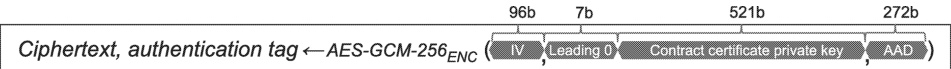

Special Publication 800-38D for this encryption. Per NIST Special Publication 800-38D, the private key shall be extended to 528 bits by padding 7 leading zero bits so that AES-GCM-256 can be applied. The Initialization Vector (IV) for this encryption shall be randomly generated before encryption and shall have a length of 96 bits with minimum entropy as defined by the implementer(s). The AAD for this encryption shall be calculated according to [V2G20-2492]. The encryption shall produce the 528-bit long ciphertext (encrypted private key) and 128 bit long authentication tag ("tag" for short).

NOTE 1 See Figure 17 for a pictorial reference.

NOTE 2 Explicit padding is required by [V2G20-2497] since the 521-bit private key is not byte aligned.

NOTE 3 Refer to 7.3.7 for further details on random number generation.

Figure 17 — 521 bit contract certificate private key encryption

## [V2G20-2498]

The byte order of all input data elements for AES-GCM-256 encryption, as specified by [V2G20-2497], shall be big-endian. This includes leading zeros needed in any data element to reach the length as prescribed by [V2G20-2497] or NIST Special Publication 800-38D.

NOTE 4 Padding of the plain text (private key) is not required when its length is a multiple of the block size of the encryption algorithm used.

The output of AES-GCM-256 encryption will be the ciphertext and the authentication tag. The 528 bit ciphertext contains the encrypted 521-bit contract certificate private key.

[V2G20-2499]

The IV (as defined by [V2G20-2497]) shall be transmitted in the 12 most significant bytes of the SECP521_EncryptedPrivateKey field. The ciphertext (encrypted private key) of 66 bytes shall be written after the IV in the SECP521_EncryptedPrivateKey field. The tag (as defined by [V2G20-2494]) shall make up the 16 least significant bytes of the SECP521_EncryptedPrivateKey field.

Figure 18 provides this structure in pictorial format.

