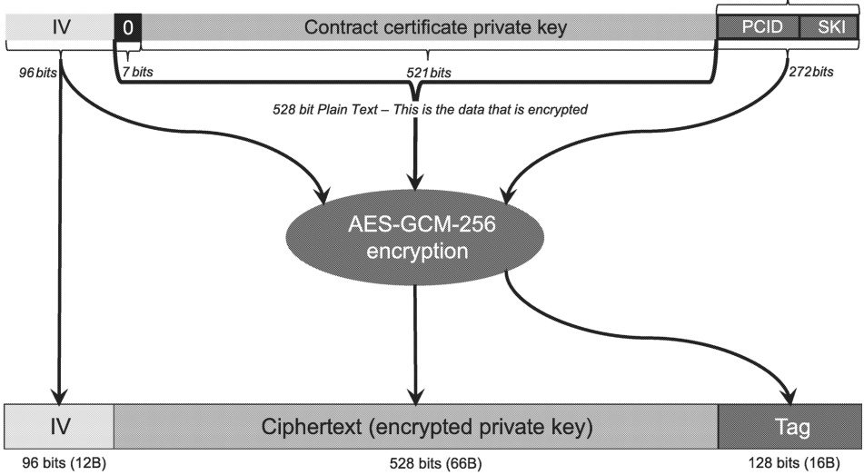
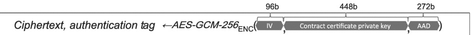

encrypted521bitPrivateKeyType

Figure 18 — encrypted521bitPrivateKeyType

######### 7.9.2.5.2.2.3 Encryption of 448 bit contract certificate private key for EVCC without TPM 2.0

The 448 bit private key corresponding to the contract certificate shall be encrypted by the sender (the SA (eMSP)) using the same session key used to encrypt the 521 bit private key in [V2G20-2497]. The sender shall apply the algorithm AES-GCM-256 according to NIST Special Publication 800-38D for this encryption. The initialization vector (IV) for this encryption shall be randomly generated before encryption and shall have a length of 96 bits with minimum entropy as defined by the implementer(s). The AAD for this encryption shall be calculated according to [V2G20-2492]. The encryption shall produce the 448 bit long ciphertext (encrypted private key) and 128 bit long authentication tag ("tag" for short).

NOTE 1 See Figure 19 for a pictorial reference.

NOTE 2 No explicit padding is required here since the 448-bit private key is byte aligned.

NOTE 3 Refer to 7.3.7 for further details on random number generation. Refer to 7.9.2.5.2.2 for further details of 521 bit contract certificate private key encryption.

Figure 19 — 448 bit contract certificate private key encryption

## [V2G20-2501]

The byte order of all input data elements for AES-GCM-256 encryption, as specified by [V2G20-2500], shall be big-endian. This includes leading zeros needed in any data element to reach the length as prescribed by [V2G20-2500] or NIST Special Publication 800-38D.

NOTE 4 Padding of the plain text (private key) is not required when its length is a multiple of the block size of the encryption algorithm used.

Copied with the permission of ANSI on behalf of ISO in connection with USDOT National Electric Vehicle Infrastructure (NEVI) Formula Program. Copying not permitted. ©ISO. All rights reserved.