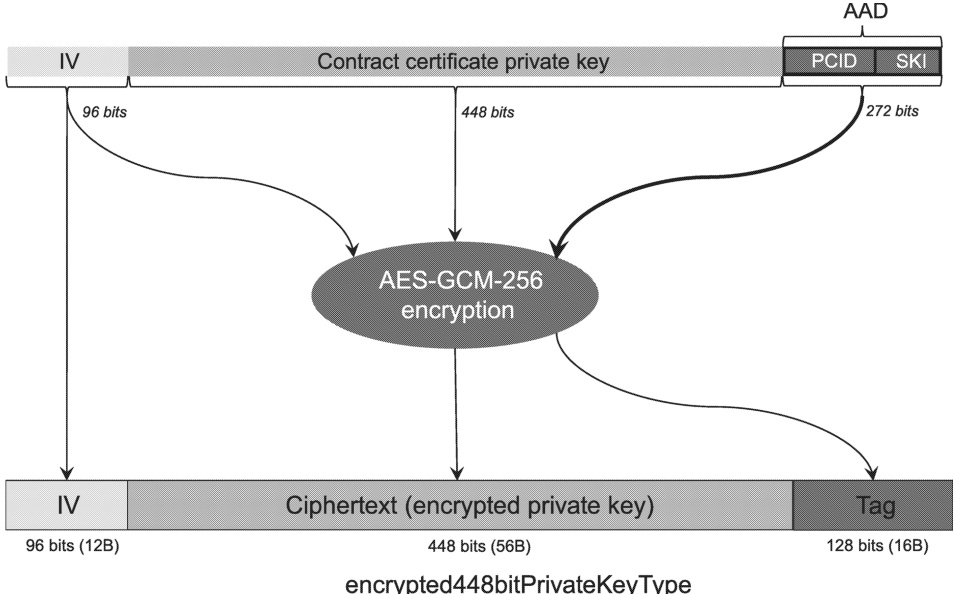

The output of AES-GCM-256 encryption will be the ciphertext and the authentication tag. The 448 bit ciphertext is the encrypted contract certificate private key.

[V2G20-2502]

The IV (as defined by [V2G20-2497]) shall be transmitted in the 12 most significant bytes of the X448_EncryptedPrivateKey field. The ciphertext (encrypted private key) of 56 bytes shall be written after the IV in the X448_EncryptedPrivateKey field. The tag (as defined by [V2G20-2494]) shall make up the 16 least significant bytes of the X448_EncryptedPrivateKey field. Figure 20 provides this structure in pictorial format.

Figure 20 — encrypted448bitPrivateKeyType

7.9.2.5.2.3 Contract certificate private key decryption mechanism for EVCC without TPM 2.0

7.9.2.5.2.3.1 Common requirements for decryption of 521-bit and 448-bit contract certificate private keys for EVCC without TPM 2.0

[V2G20-2503] The receiver shall ensure that the authenticated decryption function used to decrypt data can take an authentication tag (also known as "tag" for short) of 128 bits as the second input. Refer to 5.2.2 of NIST Special Publication 800-38D for further details.

[V2G20-2504] If the decryption of either the 521-bit private key or 448-bit private key or both fails, the receiver shall reject the CertificateInstallationRes message as invalid.

NOTE NIST Special Publication 800-38D describes some of the decryption failures. The chosen AES-GCM-256 decryption implementation can describe further failure conditions and error codes.

7.9.2.5.2.3.2 Decryption of 521-bit contract certificate private key for EVCC without TPM 2.0