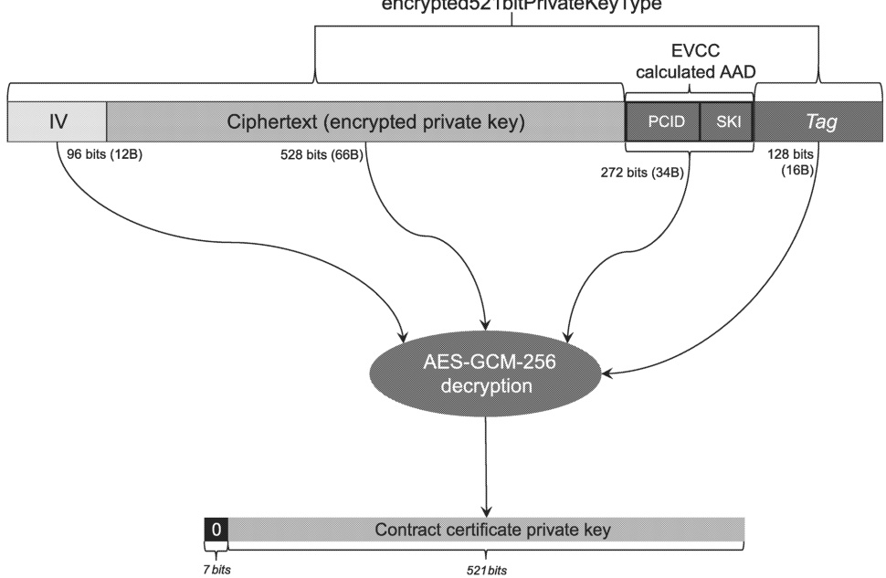
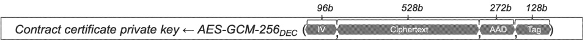

[V2G20-2505]

Upon reception of SECP521_EncryptedPrivateKey, the receiver (EVCC) shall decrypt the contract certificate private key using the session key derived in the ECDHE protocol (see 7.9.2.5.4) and applying the algorithm AES-GCM-256 according to NIST Special Publication 800-38D. The IV shall be read from the 12 most significant bytes of the SECP521_EncryptedPrivateKey field. The ciphertext (encrypted private key) shall be read from the 66 bytes after the IV in the SECP521_EncryptedPrivateKey field. The AAD for this decryption shall be calculated before decryption following [V2G20-2492] and [V2G20-2494]. The authentication tag shall be read from the 16 least significant bytes of the SECP521_EncryptedPrivateKey field.

NOTE 1 See Figure 21 for a pictorial reference of the decryption.

NOTE 2 Refer to Figure 18 further details of the SECP521\_EncryptedPrivateKey structure.

Figure 21 — 521 bit contract certificate private key decryption overview

When decrypting the data using AES-GCM-256, the order of data is important. The receiver should ensure that the input data to AES-GCM-256 decryption function/API follows NIST Special Publication 800-38D. Refer to Figure 22 for further details.

Figure 22 — 521 bit contract certificate private key decryption

## [V2G20-2678]

The EVCC shall consider the Certificate InstallationRes as invalid if the decrypted data does not contain 7 zeros in the most significant 7 bits.

[V2G20-2506] The EVCC shall use the 521 least significant bits of the decrypted data as the 521 bit contract certificate private key.

Copied with the permission of ANSI on behalf of ISO in connection with USDOT National Electric Vehicle Infrastructure (NEVI) Formula Program. Copying not permitted. ©ISO. All rights reserved.