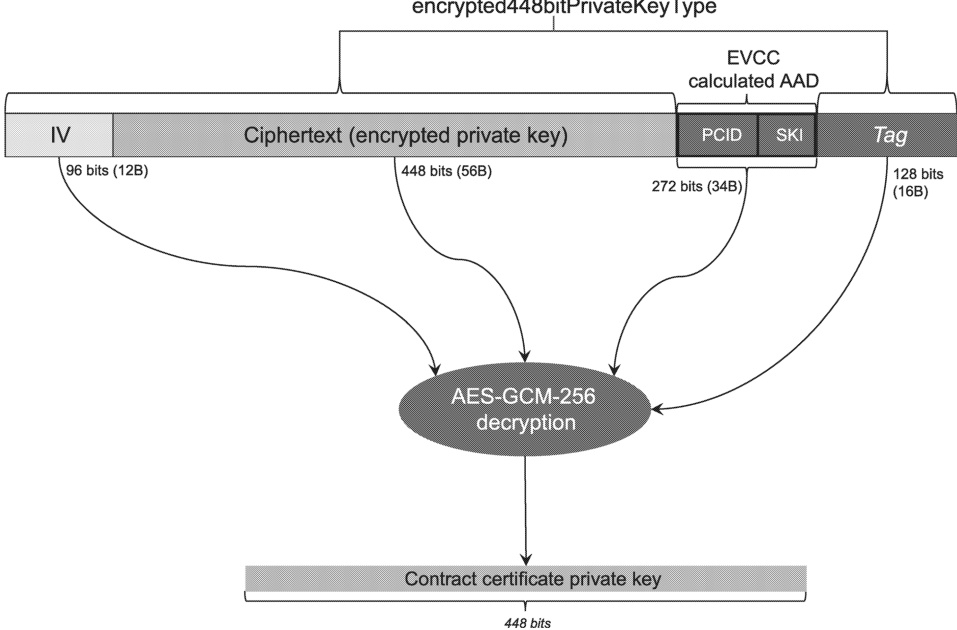

507] Upon receipt of a contract certificate, the EVCC shall verify that the 521 bit private key received with the certificate is a valid 521 bit private key for that certificate:

– its value shall be strictly smaller than the order of the base point for secp521r1 curve;

– multiplication of the base point with this value shall generate a key matching the 521 bit public key of the contract certificate.

######### 7.9.2.5.2.3.3 Decryption of 448-bit contract certificate private key for EVCC without TPM 2.0

[V2G20-2508] Upon reception of X448_EncryptedPrivateKey, the receiver (EVCC) shall decrypt the contract certificate private key using the same session key used to decrypt the 521-bit private key in [V2G20-2505] and applying the algorithm AES-GCM-256 according to NIST Special Publication 800-38D. The IV shall be read from the 12 most significant bytes of the X448_EncryptedPrivateKey field. The ciphertext (encrypted private key) shall be read from the 56 bytes after the IV in the X448_EncryptedPrivateKey field. The AAD for this decryption shall be calculated before decryption following [V2G20-2492]. The authentication tag shall be read from the 16 least significant bytes of the X448_EncryptedPrivateKey field.

NOTE 1 See Figure 23 for a pictorial reference of the decryption.

NOTE 2 Refer to Figure 20 for further details of the X448\_EncryptedPrivateKey structure.

NOTE 3 Refer to 7.9.2.5.2.3.2 for further details of 521 bit contract certificate private key decryption.

Figure 23 — 448 bit contract certificate private key decryption overview

