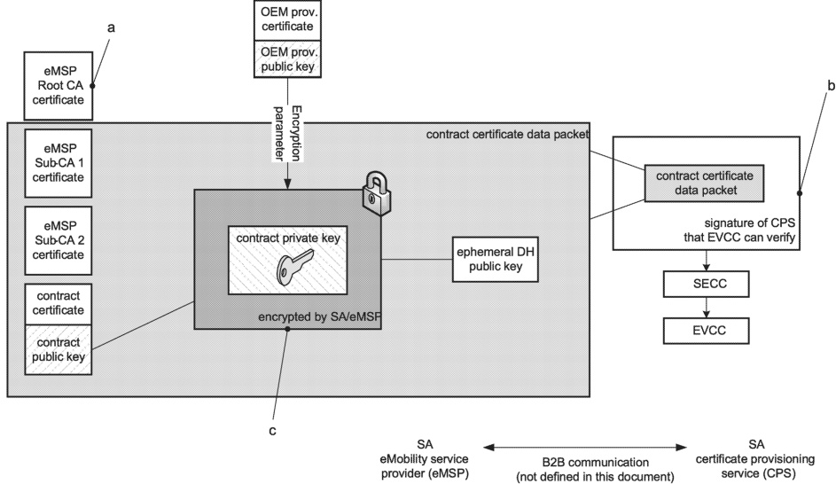

When decrypting the data using AES-GCM-256, the order of data is important. The receiver should ensure that the input data to AES-GCM-256 decryption function/API follows NIST Special Publication 800-38D. Refer to Figure 24 for further details.

## Figure 24 — 448 bit contract certificate private key decryption

[V2G20-2509] The EVCC shall use the 448 bit decrypted data as the 448 bit contract certificate private key.

[V2G20-2510] Upon receipt of a contract certificate, the EVCC shall verify that the 448 bit private key received with the certificate is a valid 448 bit private key for that certificate:

- its value shall be strictly smaller than the order of the base point for x448 curve;

AND

– multiplication of the base point with this value shall generate a key matching the 448-bit public key of the contract certificate.

7.9.2.5.3 Contract certificate installation in EVCC with TPM 2.0

## Key

This is the root certificate which the eMSP uses to derive the contract certificate. This root does not need to be present in the EVCC but the CPS needs to handle it according to well established guidelines.

b The signature of the CPS ensures that the data are authentic.

Encrypted with AES in CFB mode based on ECDH shared secret with input from the TPM 2.0 TPM storage key (public key) coming from the OEM provisioning certificate and is additionally protected with an HMAC which binds the encrypted contract private key to the corresponding contract public key.

### Figure 25 — Process for CertificateInstallationRes for EVCC equipped with TPM 2.0

## 106 

Copied with the permission of ANSI on behalf of ISO in connection with USDOT National Electric Vehicle Infrastructure (NEVI) Formula Program. Copying not permitted. ©ISO. All rights reserved.