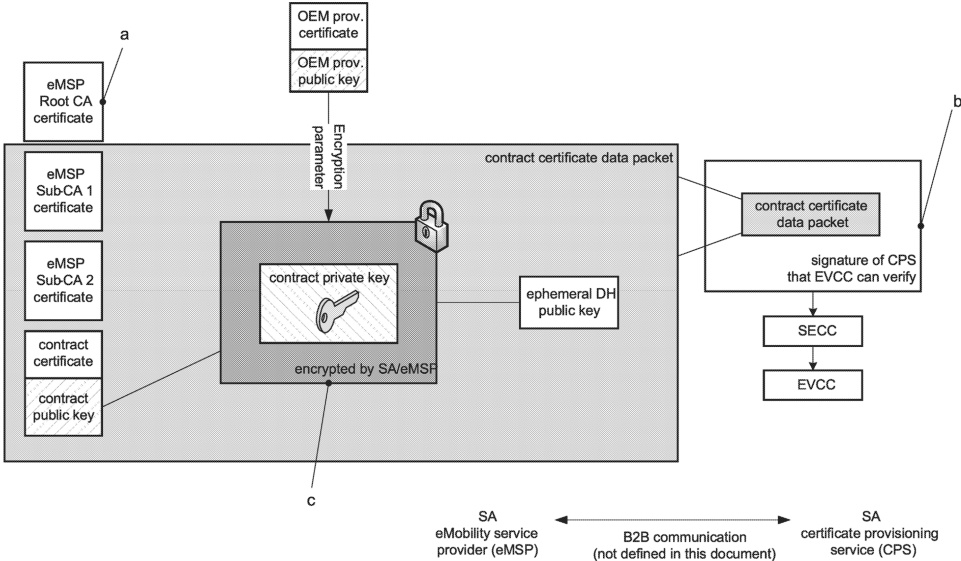

Key

This is the root certificate which the eMSP uses to derive the contract certificate. This root does not need to be present in the EVCC but the CPS needs to handle it according to well established guidelines.

b The signature of the CPS ensures that the data are authentic.

Encrypted with AES in CFB mode based on ECDH shared secret with input from the TPM 2.0 TPM storage key (public key) coming from the OEM provisioning certificate and is additionally protected with an HMAC which binds the encrypted contract private key to the corresponding contract public key.

Figure 26 — Contract key encryption for direct import into EVCC's TPM 2.0 (for (elliptic curve) EC P-521/secp521r1)

NOTE 5 Key encryption process and structures illustrated in Figure 26 are valid for both currently specified (elliptic curve) ECs. In case of the Ed448 curve, the length of the contract private key, encrypted TPM 2.0 contract private key and HMAC should be adjusted.

NOTE 6 The SA can either send secp521 (see [V2G20-2674]) or Curve448 (see [V2G20-2319]) based encrypted contract private key using the TPM_EncryptedPrivateKey parameter.

[V2G20-2522]

Once the sender sends the data to the certificate provisioning service (CPS) for verification and signature generation, the sender shall irretrievably erase/delete/destroy the contract certificate private keys (both the encrypted and unencrypted format), ECDHE private key and the session key as generated in 7.9.2.5.3.

NOTE 7 This ensures that the contract certificate private key cannot be compromised through a compromised SA. It also ensures that the ECDHE private key or session key are not reused. It further ensures that the same ciphertext is not sent out again to the receiver.

NOTE 8 This requirement is simply alluding to unencrypted contract certificate private keys, ciphertext, session keys, etc. It does not refer to the SignedInstallationData that the eMSP gets back from the CPS which includes the CPS certificates and the CPS signature on the entire data. It also does not refer to the ECDH public key that the eMSP sends to the EVCC in DHPublicKey parameter.

######## 7.9.2.5.3.4 Direct import of contract certificate private key into EVCC with TPM 2.0