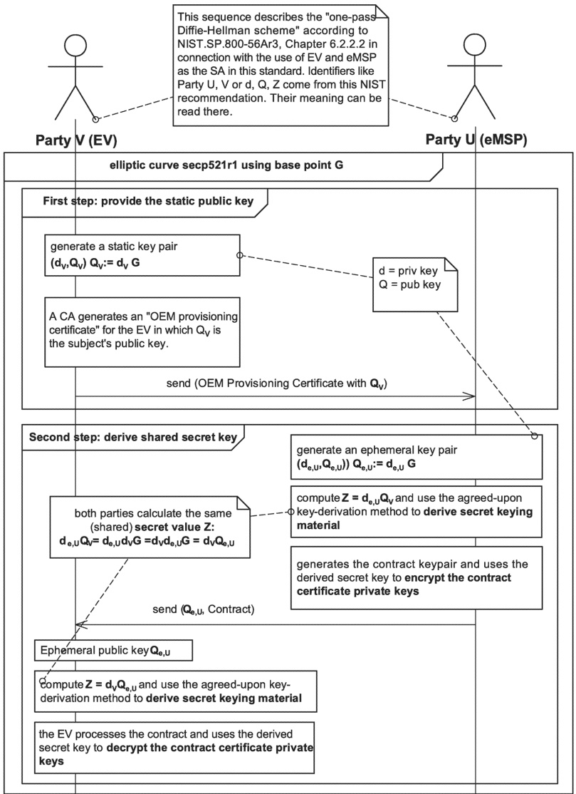

Figure 27 — Ephemeral-static Diffie-Hellman key agreement (informational depiction, do not use for implementation)

### 7.10 Application layer

#### 7.10.1 SECC discovery protocol

##### 7.10.1.1 General information