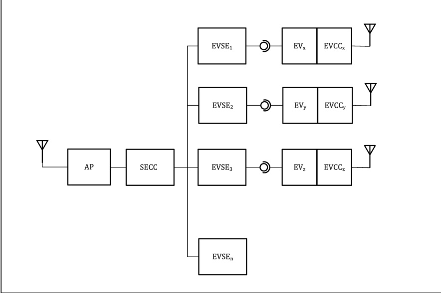

Figure 28 — Single SECC communication architecture

###### 7.10.1.2.2 Multiple SECC communication architecture

Within a multiple SECC communication architecture, every EVSE has its own SECC. All the SECCs share a common WLAN AP with an individual SSID. See Figure 29.