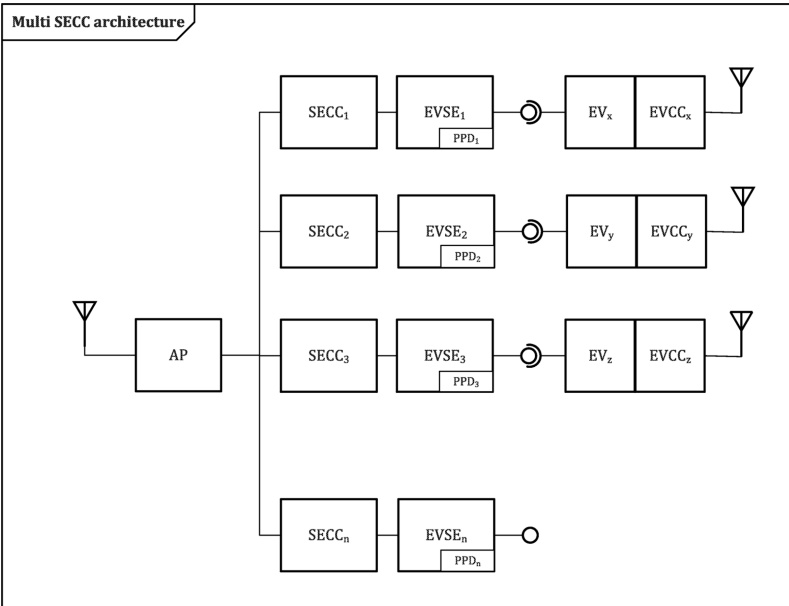

Figure 29 — Multiple SECC communication architecture

##### 7.10.1.3 Supported ports

SDP is a UDP based protocol. The ports listed in Table 20 are used by SDP.

Table 20 — Supported UDP ports for SDP

<table border=1 style='margin: auto; word-wrap: break-word;'><tr><td style='text-align: center; word-wrap: break-word;'>Name</td><td style='text-align: center; word-wrap: break-word;'>Protocol</td><td style='text-align: center; word-wrap: break-word;'>Port number</td><td style='text-align: center; word-wrap: break-word;'>Description</td></tr><tr><td style='text-align: center; word-wrap: break-word;'>V2G_UDP_SDP_CLIENT</td><td style='text-align: center; word-wrap: break-word;'>UDP (unicast)</td><td style='text-align: center; word-wrap: break-word;'>Port number in the range of Dynamic Ports (49152-65535) as defined in IETF RFC 6335.</td><td style='text-align: center; word-wrap: break-word;'>SDP client source port at the EVCC</td></tr><tr><td style='text-align: center; word-wrap: break-word;'>V2G_UDP_SDP_SERVER</td><td style='text-align: center; word-wrap: break-word;'>UDP (multicast)</td><td style='text-align: center; word-wrap: break-word;'>15118</td><td style='text-align: center; word-wrap: break-word;'>SDP server port which accepts UDP packets with a local-link IP multicast destination address.</td></tr></table>

[V2G20-123] An SDP server shall be accessible in the local link network.

NOTE 1 As common for internet technologies, SDP server can be implemented on the same physical device as the SECC and can also interface to the same IP address. If this is not the case, optimistic DAD as specified in IETF RFC 4429 will not lead to a benefit.

NOTE 2 IETF RFC 4429 has been updated IETF RFC 7527. These updates are considered to be included in this document.

An SDP client shall support the port V2G\_UDP\_SDP\_CLIENT as defined in Table 20 for sending and receiving SDP messages.

Copied with the permission of ANSI on behalf of ISO in connection with USDOT National Electric Vehicle Infrastructure (NEVI) Formula Program. Copying not permitted. ©ISO. All rights reserved.