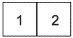
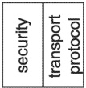

[V2G20-139] An SDP client shall send SECC discovery request message to the destination local-link multicast address (FF02:1) as defined in IETF RFC 4291.

[V2G20-1254] The SDP client shall send the SECC discovery request message with payload type SDPRequestPayloadID as defined in Table 14.

[V2G20-141] The SDP client shall send the SECC discovery request message with the payload length 2.

[V2G20-142] The SDP client shall send the SECC discovery request message with the payload as defined in Figure 30.

[V2G20-622] An SDP client shall send the payload in the order as shown in Figure 30. A byte with a lower number shall be sent before a byte with a higher number. The payload starts with byte 1 and ends with byte 2.

Byte No.

Figure 30 — SECC discovery request message payload

[V2G20-623] An SDP client shall use the encoding for the requested security option and the requested transport protocol as defined in Table 21.

Table 21 — SDP security and protocol option encoding

<table border=1 style='margin: auto; word-wrap: break-word;'><tr><td style='text-align: center; word-wrap: break-word;'>Description</td><td style='text-align: center; word-wrap: break-word;'>Security</td><td style='text-align: center; word-wrap: break-word;'>Transport protocol</td></tr><tr><td style='text-align: center; word-wrap: break-word;'>Byte no. SDP request message</td><td style='text-align: center; word-wrap: break-word;'>1</td><td style='text-align: center; word-wrap: break-word;'>2</td></tr><tr><td style='text-align: center; word-wrap: break-word;'>Byte no. SDP response message</td><td style='text-align: center; word-wrap: break-word;'>19</td><td style='text-align: center; word-wrap: break-word;'>20</td></tr><tr><td style='text-align: center; word-wrap: break-word;'>Applicable values</td><td style='text-align: center; word-wrap: break-word;'>0x00 = secured with TLS\n0x01-0x0F = reserved\n0x10 = No transport layer security\n0x11-0xFF = reserved</td><td style='text-align: center; word-wrap: break-word;'>0x00 = TCP\n0x01-0x0F = reserved\n0x10 = reserved for UDP\n0x11-0xFF = reserved</td></tr></table>

NOTE In this document, all communication after the SDP handshake uses TLS and TCP. Therefore, the parameter "Security" is typically set to "TLS" and the parameter "Transport Protocol" is typically set to "TCP". The value "No transport layer security" for the parameter "Security" is used to continue with unencrypted communication according to DIN SPEC 70121 or ISO 15118-2 with EIM.

##### 7.10.1.6 SECC discovery response message for communication according to ISO 15118-3

The SDP server uses the SDP response message to respond to an SDP request message and provide the IP-address and the port of the SECC to the client.

[V2G20-143]

The SDP server shall be able to extract the source IP address and source port of a received UDP packet (client IP address and port number) and send a UDP packet to the identified IP address and port number.

