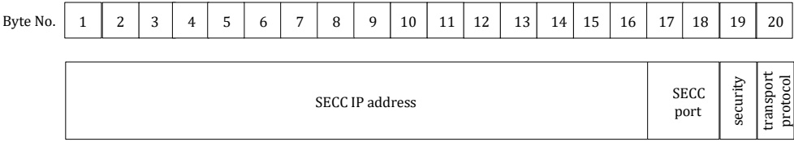

[V2G20-144] An SDP server shall reply to any SECC discovery request messages with an SECC discovery response Message.

NOTE 1 This requirement ensures that an SDP server serving multiple clients can be reached at any time. This supports charging of multiple EVs at an EVSE with a single SECC.

[V2G20-145] An SDP client shall not reply to any SECC discovery request message.

[V2G20-146] An SDP server shall only send response messages after an SECC discovery request message has been received.

NOTE 2 For detailed timing requirements refer to requirements [V2G20-159] - [V2G20-162].

[V2G20-149] An SDP server shall send an SDP response with source port V2G_UDP_SDP_SERVER as defined in Table 20.

[V2G20-150] An SDP server shall send an SECC discovery response message to the SDP client which sent the SECC discovery request message.

[V2G20-151] An SDP server shall send an SECC discovery response message to the port of the SDP client which sent the SECC discovery request message.

[V2G20-1255] An SDP server shall send the SECC discovery response message with the payload type SDPResponsePayloadID as defined in Table 14.

[V2G20-153] An SDP server shall send the SECC discovery response message with payload length 20.

[V2G20-154] An SDP server shall send the SECC discovery response message with the payload as defined in Figure 31.

[V2G20-155] An SDP server shall send the payload in the order as shown in Figure 31. A byte with a lower number shall be sent before a byte with a higher number. The payload starts with byte 1 and ends with byte 20.

[V2G20-156] An SDP server shall send the fields "SECC IP address" and "SECC port" in big-endian format The most significant byte is sent first the least significant byte is sent last.

NOTE 3 The mechanism used by the SDP server to determine its own IP address is out of the scope of this document.

NOTE 4 The source IP address and the source port of a received UDP packet is usually provided by the TCP/IP stack.

<table border=1 style='margin: auto; word-wrap: break-word;'><tr><td style='text-align: center; word-wrap: break-word;'>Byte No.</td><td style='text-align: center; word-wrap: break-word;'>1</td><td style='text-align: center; word-wrap: break-word;'>2</td><td style='text-align: center; word-wrap: break-word;'>3</td><td style='text-align: center; word-wrap: break-word;'>4</td><td style='text-align: center; word-wrap: break-word;'>5</td><td style='text-align: center; word-wrap: break-word;'>6</td><td style='text-align: center; word-wrap: break-word;'>7</td><td style='text-align: center; word-wrap: break-word;'>8</td><td style='text-align: center; word-wrap: break-word;'>9</td><td style='text-align: center; word-wrap: break-word;'>10</td><td style='text-align: center; word-wrap: break-word;'>11</td><td style='text-align: center; word-wrap: break-word;'>12</td><td style='text-align: center; word-wrap: break-word;'>13</td><td style='text-align: center; word-wrap: break-word;'>14</td><td style='text-align: center; word-wrap: break-word;'>15</td><td style='text-align: center; word-wrap: break-word;'>16</td><td style='text-align: center; word-wrap: break-word;'>17</td><td style='text-align: center; word-wrap: break-word;'>18</td><td style='text-align: center; word-wrap: break-word;'>19</td><td style='text-align: center; word-wrap: break-word;'>20</td></tr></table>

Figure 31 — SECC discovery response message payload

[V2G20-624] An SDP server shall use the encoding for the requested security option and the requested transport protocol as defined in Table 21 to define the supported