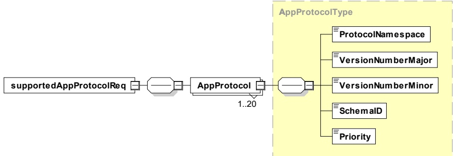
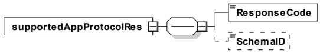

[V2G20-2133] The namespaces "urn:iso:std:iso:15118:-20:CommonMessages" and "urn:iso:std:iso:15118:-20:CommonTypes" shall never be used in the context of the supportedAppProtocolReq.

[V2G20-171] All additional data elements defined by the respective minor version shall be encoded as schema deviated case by the EXI coder (see also EXI option settings in 7.9.1.3).

[V2G20-172] Usually it is expected that the SECC is able to support the relevant application layer protocols indicated by the EVCC. However when none of the application layer protocols included in the list received from the EVCC is supported by the SECC, the ResponseCode in the response message shall be equal to Failed_NoNegotiation indicating that the protocol negotiation was not successful. In this error scenario the response message shall not include a SchemaID.

[V2G20-173] If no successful protocol negotiation can be achieved the EVCC shall not initialize a communication session.

[V2G20-1837] EVSE that supports basic charging as defined in IEC61851-1 shall revert to basic charging after sending a ResponseCode equal to "Failed_NoNegotiation" in the supportedAppProtocolRes message.

NOTE 2 In the "Failed_NoNegotiation" error case, the V2G session is terminated. It is the responsibility of the EVSE to ensure a clean transition to basic charging. In case the authorization was successfully completed before protocol negotiation was performed (e.g. using EIM), it is up to the EVSE to ensure that transition to basic charging does not require a repeated authorization procedure.

#### 8.2.2 Message definition supportedAppProtocolReq and supportedAppProtocolRes

[V2G20-175] The SECC and EVCC shall implement the message elements as defined in Figure 32.

Figure 32 — Schema diagram - supportedAppProtocolReq

[V2G20-176] The SECC and EVCC shall implement the message elements as defined in Figure 33.

Figure 33 — Schema diagram - supportedAppProtocolRes

