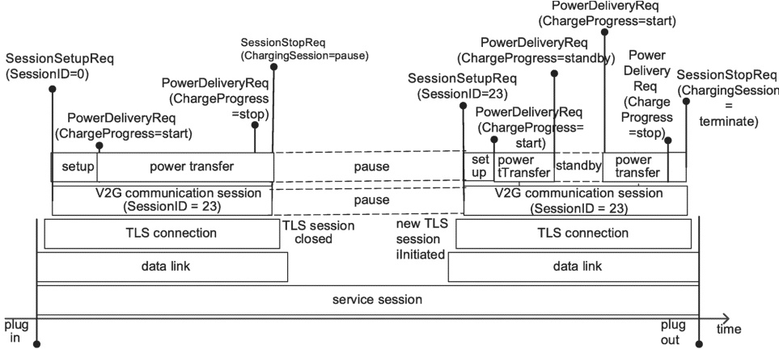

During conductive charging applying communication via PLC, the conductive connection, e.g. of the charging cable, needs be maintained throughout a service session, including both pause and standby periods.

The example in Figure 34 shows two V2G communication sessions separated by a pause period and a standby period during the latter V2G communication session, illustrating their relation over time to the TCP/TLS connections, the data link establishment, the service session, and the power transfer between EV and EVSE.

For safety reasons to enter a standby period in DC or WPT, an EV will gradually decrease the current to 0A before sending a PowerDeliveryReq message with ChargeProgress set to "Standby".

An EV or EVSE may want to change the charging service or the prior agreed charging schedule in the same communication session, therefore the "renegotiation" concept is introduced. Two types of renegotiation are set. The first one is the "ServiceRenegotiation" as a means to change the charging service. The second one is the "ScheduleRenegotiation" as an option to change the prior agreed schedules. For further information see Annex F.

Figure 34 — Example of V2G communication session handling

#### 8.3.2 General

This subclause and the subclauses within describe the messages of the V2G messages and their contents.

[V2G20-2314] Whenever a requirement only refers to ChargeParameterDiscoveryReq/Res, this requirement applies to all energy transfer mode specific extensions, e.g. DC_ChargeParameterDiscoveryReq/Res.

[V2G20-2315] Whenever a requirement only refers to ChargeLoopReq/Res, this requirement applies to all energy transfer mode specific extensions, e.g. DC_ChargeLoopReq/Res.

The application layer message set defined in this document is signalized by the XML schema namespace "urn:iso:std:iso:15118:-20". Refer to the XML schema definition in Annex A for details relative to sub-namespace definitions used for the message definition and for the XML schema code.

#### 8.3.3 Header definition

##### 8.3.3.1 General