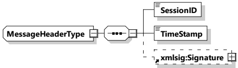

The message header contains general information that is included in all messages. Figure 35 shows the schema definition of the V2G message header.

Figure 35 — Schema diagram - message header

[V2G20-2676] The message elements of the message header shall be used as defined in Table 31.

Table 31 — Semantics and type definition for a V2G message header

<table border=1 style='margin: auto; word-wrap: break-word;'><tr><td style='text-align: center; word-wrap: break-word;'>Element Name</td><td style='text-align: center; word-wrap: break-word;'>Type</td><td style='text-align: center; word-wrap: break-word;'>Semantics</td></tr><tr><td style='text-align: center; word-wrap: break-word;'>SessionID</td><td style='text-align: center; word-wrap: break-word;'>simpleType: sessionIDType refer to Annex A for the type definition</td><td style='text-align: center; word-wrap: break-word;'>This message element is used by EVCC and SECC for uniquely identifying a V2G communication session. Refer to 8.3.4.1 for requirements relative to this message element.</td></tr><tr><td style='text-align: center; word-wrap: break-word;'>TimeStamp</td><td style='text-align: center; word-wrap: break-word;'>simpleType xs:unsignedLong</td><td style='text-align: center; word-wrap: break-word;'>Timestamp that marks the time of message creation. The value is encoded at microseconds resolution in SECC time, a concept that is defined in 8.3.3.3</td></tr><tr><td style='text-align: center; word-wrap: break-word;'>xmlsig:Signature</td><td style='text-align: center; word-wrap: break-word;'>separate namespace: &quot;http://www.w3.org/2000/09/xmldig#&quot;</td><td style='text-align: center; word-wrap: break-word;'>Optional: This element is used if a certain V2G message requires to be signed.</td></tr></table>

[V2G20-182] Each V2G message containing signed elements shall include the xmlsig:Signature element in the header to be able to transmit the signature attached to signed body message elements of the respective message.

[V2G20-1022] After having received the SessionSetupRes, the EVCC shall check if the SessionID included in any following response messages is the same as the one received during SessionSetupRes.

##### 8.3.3.2 Coordinated activities

One of the primary design goals within this document is to provide the means to coordinate activities on the two sides of the charging cable. For the scheduled control mode, where power schedules are negotiated which then define future behavior, this leads to the necessity of a concept of coordinated time.

In addition, it is necessary to ensure the validity of certificates or to coordinate activities based on power or price schedules which have been created by external secondary actors outside the local communication network. So a clear definition of a relationship to coordinated universal time (UTC) is required.

While time appears like a trivial issue there are a number of technical requirements that need to be satisfied within this context. Besides the regular questions of the handling of leap seconds, time zones