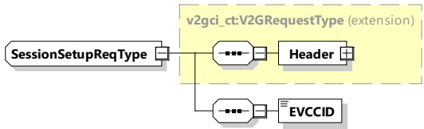
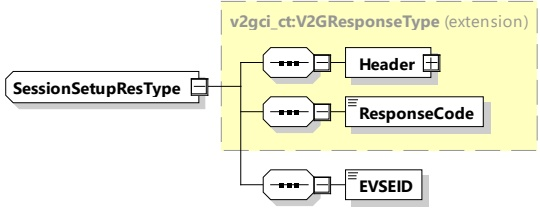

[V2G20-1246] The EVCC and the SECC shall implement the message elements as defined in Table 32 and Figure 36.

Figure 36 — Schema diagram - SessionSetupReq

The element of this message is used according to Table 32.

Table 32 — Semantics and type definition for SessionSetupReq

<table border=1 style='margin: auto; word-wrap: break-word;'><tr><td style='text-align: center; word-wrap: break-word;'>Element Name</td><td style='text-align: center; word-wrap: break-word;'>Type</td><td style='text-align: center; word-wrap: break-word;'>Semantics</td></tr><tr><td style='text-align: center; word-wrap: break-word;'>Header</td><td style='text-align: center; word-wrap: break-word;'>complexType:MessageHeaderTypeRefer to 8.3.3</td><td style='text-align: center; word-wrap: break-word;'>Contains general information, used for all messages.</td></tr><tr><td style='text-align: center; word-wrap: break-word;'>EVCCID</td><td style='text-align: center; word-wrap: break-word;'>simpleType:identifierTyperefer to Annex A for the type definition</td><td style='text-align: center; word-wrap: break-word;'>Specifies the EVCC&#x27;s unique identifier.</td></tr></table>

[V2G20-1062] The EVCC shall transmit an EVCCID with the first 3 bytes containing the WMI as defined in ISO 3780:2009.

####### 8.3.4.3.1.2 SessionSetupRes

By using the SessionSetupRes the SECC responds to a SessionSetupReq. With the SessionSetupRes the SECC notifies the EVCC with an enclosed ResponseCode, whether establishing a new session or joining a previous communication session was successful or not.

7] The EVCC and the SECC shall implement the message elements as defined in Table 33 and Figure 37.

Figure 37 — Schema diagram - SessionSetupRes

The elements of this message are used according to Table 33.

Table 33 — Semantics and type definition for SessionSetupRes

<table border=1 style='margin: auto; word-wrap: break-word;'><tr><td style='text-align: center; word-wrap: break-word;'>Element Name</td><td style='text-align: center; word-wrap: break-word;'>Type</td><td style='text-align: center; word-wrap: break-word;'>Semantics</td></tr></table>

Copied with the permission of ANSI on behalf of ISO in connection with USDOT National Electric Vehicle Infrastructure (NEVI) Formula Program. Copying not permitted. ©ISO. All rights reserved.