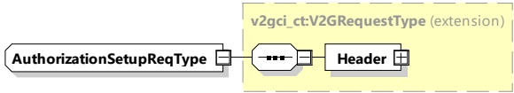

<table border=1 style='margin: auto; word-wrap: break-word;'><tr><td style='text-align: center; word-wrap: break-word;'>Header</td><td style='text-align: center; word-wrap: break-word;'>complexType: MessageHeaderType Refer to 8.3.3</td><td style='text-align: center; word-wrap: break-word;'>Contains general information, used for all messages.</td></tr><tr><td style='text-align: center; word-wrap: break-word;'>ResponseCode</td><td style='text-align: center; word-wrap: break-word;'>simpleType: responseCodeType enumeration refer to Annex A for the type definition</td><td style='text-align: center; word-wrap: break-word;'>ResponseCode indicating the acknowledgment status of any of the V2G messages received by the SECC.</td></tr><tr><td style='text-align: center; word-wrap: break-word;'>EVSEID</td><td style='text-align: center; word-wrap: break-word;'>simpleType: identifierType refer to Annex A for the type definition</td><td style='text-align: center; word-wrap: break-word;'>Any ID that uniquely identifies the EVSE and the power outlet the EV is connected to. The format of this message element is defined in Annex C. If an SECC cannot provide such ID data, the value of the EVSEID is set to zero (&quot;ZZ00000&quot;).</td></tr></table>

[V2G20-192] The SECC and the EVCC shall use the format for EVSEID as defined in Annex C.

###### 8.3.4.3.2 AuthorizationSetupReq/Res

This subclause, and all subclauses within it, will provide specific and separate requirements for the private SECC and the SECC. Thus, unless otherwise specified for this subclause or any subclause within it, private SECC and SECC are not considered interchangeable.

####### 8.3.4.3.2.1 AuthorizationSetupReq

Message is empty, besides the header, and is only required to start the process of choosing the authorization method.

[V2G20-1066]

The EVCC and the SECC shall implement the message elements as defined in Figure 38 and Table 34.

Figure 38 — Schema diagram - AuthorizationSetupReq

The elements of this message are used according to Table 34.

Table 34 — Semantics and type definition for AuthorizationSetupReq

<table border=1 style='margin: auto; word-wrap: break-word;'><tr><td style='text-align: center; word-wrap: break-word;'>Element Name</td><td style='text-align: center; word-wrap: break-word;'>Type</td><td style='text-align: center; word-wrap: break-word;'>Semantics</td></tr><tr><td style='text-align: center; word-wrap: break-word;'>Header</td><td style='text-align: center; word-wrap: break-word;'>complexType:MessageHeaderTypeRefer to 8.3.3</td><td style='text-align: center; word-wrap: break-word;'>Contains general information, used for all messages.</td></tr></table>

####### 8.3.4.3.2.2 AuthorizationSetupRes

The SECC provides information about the available authorization modes and whether the certificate installation service is available.