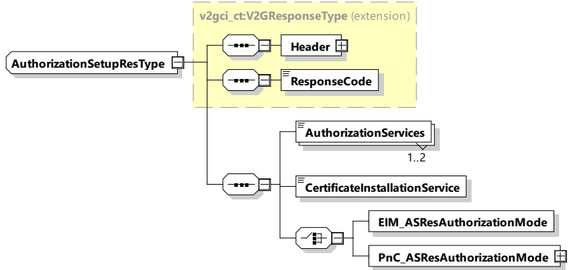

[V2G20-1067]

The EVCC and the SECC shall implement the message elements as defined in Figure 39 and Table 35.

Figure 39 — Schema diagram - AuthorizationSetupRes

The elements of this message are used according to Table 35.

Table 35 — Semantics and type definition for AuthorizationSetupRes

<table border=1 style='margin: auto; word-wrap: break-word;'><tr><td style='text-align: center; word-wrap: break-word;'>Element Name</td><td style='text-align: center; word-wrap: break-word;'>Type</td><td style='text-align: center; word-wrap: break-word;'>Semantics</td></tr><tr><td style='text-align: center; word-wrap: break-word;'>Header</td><td style='text-align: center; word-wrap: break-word;'>complexType: MessageHeaderType Refer to 8.3.3</td><td style='text-align: center; word-wrap: break-word;'>Contains general information, used for all messages.</td></tr><tr><td style='text-align: center; word-wrap: break-word;'>ResponseCode</td><td style='text-align: center; word-wrap: break-word;'>simpleType: responseCodeType enumeration refer to Annex A for the type definition</td><td style='text-align: center; word-wrap: break-word;'>ResponseCode indicating the acknowledgment status of any of the V2G messages received by the SECC.</td></tr><tr><td style='text-align: center; word-wrap: break-word;'>AuthorizationServices</td><td style='text-align: center; word-wrap: break-word;'>simple Type: authorizationType enumeration refer to Annex A for the type definition</td><td style='text-align: center; word-wrap: break-word;'>A parameter that indicates which Authorization Service the EVSE can provide.</td></tr><tr><td style='text-align: center; word-wrap: break-word;'>CertificateInstallationService</td><td style='text-align: center; word-wrap: break-word;'>simpleType: xs:boolean</td><td style='text-align: center; word-wrap: break-word;'>If set to true, the EVSE provides the CertificateInstallation service.</td></tr><tr><td style='text-align: center; word-wrap: break-word;'>EIM_ASResAuthorizationMode</td><td style='text-align: center; word-wrap: break-word;'>complexType: EIM_ASResAuthorizationModeType refer to 8.3.5.3.33</td><td style='text-align: center; word-wrap: break-word;'>Element to be sent when EIM is chosen as authorization method.</td></tr><tr><td style='text-align: center; word-wrap: break-word;'>PnC_ASResAuthorizationMode</td><td style='text-align: center; word-wrap: break-word;'>complexType: PnC_ASResAuthorizationModeType refer to 8.3.5.3.34</td><td style='text-align: center; word-wrap: break-word;'>Includes the challenge by the SECC. This element contains the generated random number.</td></tr></table>