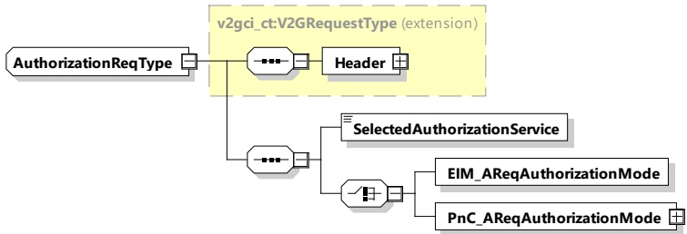

[V2G20-1219] If in message AuthorizationSetupRes, the SECC offers the service "PnC" in the parameter AuthorizationServices, the SECC shall use the element PnC_ASResAuthorizationMode.

[V2G20-1220] If in message AuthorizationSetupRes, the SECC does not offer the service "PnC" in the parameter AuthorizationServices, the SECC shall use the element EIM_ASResAuthorizationMode.

[V2G20-2096] In case authorization has already been completed by the time AuthorizationSetupReq is received by the SECC or authorization is not necessary, the SECC shall only offer EIM in AuthorizationSetupRes.

[V2G20-2566] The SECC shall indicate via AuthorizationServices parameter, in AuthorizationSetupRes message, the authorization service(s) offered by the SECC. The SECC could offer EIM or PnC or both as the authorization service(s).

[V2G20-2567] If the SECC offers only EIM as an authorization service, it shall include parameter EIM_ASResAuthorizationMode in AuthorizationSetupRes message.

[V2G20-2568] If the SECC offers PnC as an authorization service, it shall include parameter PnC_ASResAuthorizationMode in AuthorizationSetupRes message.

[V2G20-2570] A private SECC that did not offer OCSP responses for its PE certificate chain shall not provide PnC as an authorization service. Such a private SECC shall not indicate PnC as a supported service in AuthorizationServices parameter in AuthorizationSetupRes message. Consequently, this private SECC shall not include PnC_ASResAuthorizationMode in AuthorizationSetupRes message.

###### 8.3.4.3.3 AuthorizationReq/Res

This subclause, and all subclauses within it, will provide specific and separate requirements for the private SECC and the SECC. Thus, unless otherwise specified for this subclause or any subclause within it, private SECC and SECC are not considered interchangeable.

####### 8.3.4.3.3.1 AuthorizationReq

[V2G20-1256] The EVCC and the SECC shall implement the message elements as defined in Table 36 and Figure 40.

Figure 40 — Schema diagram - AuthorizationReq

The elements of this message are used according to Table 36.