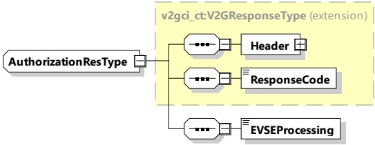

NOTE 1 During TLS session setup, the EVCC can determine that the received certificate chain is linked to a PE private root CA certificate. In that case, the received certificate is a PE certificate and the EVCC is connected to a private SECC in a private environment.

NOTE 2 Similarly, the EVCC can determine if the OCSP responses were received for all the certificates in the PE certificate chain.

[V2G20-1063] In case of PnC, the EVCC shall sign the PnC_AReqAuthorizationMode element using the private key associated with the contract certificate.

####### 8.3.4.3.3.2 AuthorizationRes

Finally, in case of PnC, the SECC verifies the challenge signature (and the certificate with its chain if not done before) and sends the corresponding authorization response message.

In case of EIM, the authorization response message is sent based on external inputs and/or SECC setup/configuration.

[V2G20-1257] The EVCC and the SECC shall implement the message elements as defined in Table 37 and Figure 41.

Figure 41 — Schema diagram - AuthorizationRes

The elements of this message are used according to Table 37.

Table 37 — Semantics and type definition for AuthorizationRes

<table border=1 style='margin: auto; word-wrap: break-word;'><tr><td style='text-align: center; word-wrap: break-word;'>Element Name</td><td style='text-align: center; word-wrap: break-word;'>Type</td><td style='text-align: center; word-wrap: break-word;'>Semantics</td></tr><tr><td style='text-align: center; word-wrap: break-word;'>Header</td><td style='text-align: center; word-wrap: break-word;'>complexType:MessageHeaderTypeRefer to 8.3.3</td><td style='text-align: center; word-wrap: break-word;'>Contains general information, used for all messages.</td></tr><tr><td style='text-align: center; word-wrap: break-word;'>ResponseCode</td><td style='text-align: center; word-wrap: break-word;'>simpleType:responseCodeTypeenumerationrefer to Annex A for the type definition</td><td style='text-align: center; word-wrap: break-word;'>ResponseCode indicating the acknowledgment status of any of the V2G messages received by the SECC.</td></tr><tr><td style='text-align: center; word-wrap: break-word;'>EVSEProcessing</td><td style='text-align: center; word-wrap: break-word;'>simpleType:processingTypeenumerationrefer to Annex A for the type definition</td><td style='text-align: center; word-wrap: break-word;'>Parameter indicating that the EVSE has finished the processing that was initiated after the AuthorizationReq or if the EVSE is still processing at the time, the response message was sent.</td></tr></table>