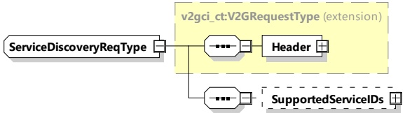
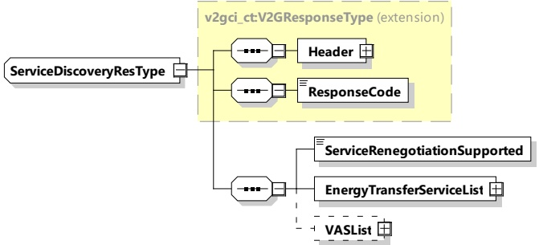

Figure 42 — Schema diagram - ServiceDiscoveryReq

The elements of this message are used according to Table 38.

Table 38 — Semantics and type definition for ServiceDiscoveryReq

<table border=1 style='margin: auto; word-wrap: break-word;'><tr><td style='text-align: center; word-wrap: break-word;'>Element Name</td><td style='text-align: center; word-wrap: break-word;'>Type</td><td style='text-align: center; word-wrap: break-word;'>Semantics</td></tr><tr><td style='text-align: center; word-wrap: break-word;'>Header</td><td style='text-align: center; word-wrap: break-word;'>complexType:MessageHeaderTypeRefer to 8.3.3</td><td style='text-align: center; word-wrap: break-word;'>Contains general information, used for all messages.</td></tr><tr><td style='text-align: center; word-wrap: break-word;'>SupportedServiceIDs</td><td style='text-align: center; word-wrap: break-word;'>complexType:ServiceIDListTyperefer to 8.3.5.3.29</td><td style='text-align: center; word-wrap: break-word;'>Optional:A list that contains all ServiceIDs that the EV supports.This list can be used to filter the services that the EVSE will offer in the ServiceDiscoveryRes.When omitted, the EVCC intends to receive all provided services by SECC in ServiceDiscoveryRes message</td></tr></table>

####### 8.3.4.3.4.3 ServiceDiscoveryRes

After receiving the ServiceDiscoveryReq message of the EVCC the SECC sends the ServiceDiscoveryRes message. It includes a list of all services available at the SECC.

[V2G20-1249]

The EVCC and the SECC shall implement the message elements as defined in Table 39 and Figure 43.

Figure 43 — Schema diagram - ServiceDiscoveryRes

The elements of this message are used according to Table 39.

Table 39 — Semantics and type definition for ServiceDiscoveryRes

