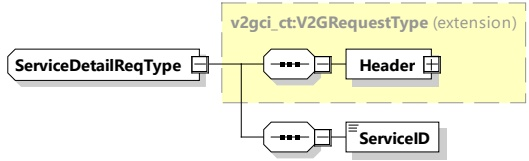

<table border=1 style='margin: auto; word-wrap: break-word;'><tr><td style='text-align: center; word-wrap: break-word;'>Element Name</td><td style='text-align: center; word-wrap: break-word;'>Type</td><td style='text-align: center; word-wrap: break-word;'>Semantics</td></tr><tr><td style='text-align: center; word-wrap: break-word;'>Header</td><td style='text-align: center; word-wrap: break-word;'>complexType: MessageHeaderType Refer to 8.3.3</td><td style='text-align: center; word-wrap: break-word;'>Contains general information, used for all messages.</td></tr><tr><td style='text-align: center; word-wrap: break-word;'>ResponseCode</td><td style='text-align: center; word-wrap: break-word;'>simpleType: responseCodeType enumeration refer to Annex A for the type definition</td><td style='text-align: center; word-wrap: break-word;'>ResponseCode indicating the acknowledgment status of any of the V2G messages received by the SECC.</td></tr><tr><td style='text-align: center; word-wrap: break-word;'>ServiceRenegotiationSupported</td><td style='text-align: center; word-wrap: break-word;'>simpleType: xs:boolean</td><td style='text-align: center; word-wrap: break-word;'>If set to &quot;True&quot; the SECC is capable of ServiceRenegotiation as specified in this document. If set to &quot;FALSE&quot; the SECC is not capable of ServiceRenegotiation. The value of this parameter is valid throughout the service session.</td></tr><tr><td style='text-align: center; word-wrap: break-word;'>EnergyTransferServiceList</td><td style='text-align: center; word-wrap: break-word;'>complexType: ServiceListType refer to 8.3.5.3.2</td><td style='text-align: center; word-wrap: break-word;'>Available energy transfer and BPT services supported by the EVSE.</td></tr><tr><td style='text-align: center; word-wrap: break-word;'>VASList</td><td style='text-align: center; word-wrap: break-word;'>complexType: ServiceListType refer to 8.3.5.3.2</td><td style='text-align: center; word-wrap: break-word;'>Optional: A list containing information on all other services than energy transfer services offered by the EVSE. The returned service list is a filtered list based on the SupportedServiceIDs indicated in the ServiceDiscoveryReq message. The number of service elements is limited to eight.</td></tr></table>

###### 8.3.4.3.5 ServiceDetailReq/Res

####### 8.3.4.3.5.1 ServiceDetailReq

By sending the ServiceDetailReq message the EVCC requests the SECC to send specific additional information about services offered by the EVSE.

V2G20-1250] The EVCC and the SECC shall implement the message elements as defined in Table 40 and Figure 44.

Figure 44 — Schema diagram - ServiceDetailReq

The element of this message is used according to Table 40.

## Table 40 — Semantics and type definition for ServiceDetailReq

Copied with the permission of ANSI on behalf of ISO in connection with USDOT National Electric Vehicle Infrastructure (NEVI) Formula Program. Copying not permitted. ©ISO. All rights reserved.