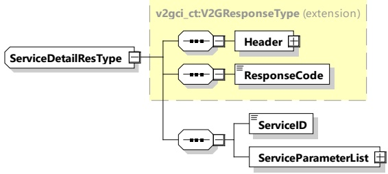

<table border=1 style='margin: auto; word-wrap: break-word;'><tr><td style='text-align: center; word-wrap: break-word;'>Element Name</td><td style='text-align: center; word-wrap: break-word;'>Type</td><td style='text-align: center; word-wrap: break-word;'>Semantics</td></tr><tr><td style='text-align: center; word-wrap: break-word;'>Header</td><td style='text-align: center; word-wrap: break-word;'>complexType:MessageHeaderTypeRefer to 8.3.3</td><td style='text-align: center; word-wrap: break-word;'>Contains general information, used for all messages.</td></tr><tr><td style='text-align: center; word-wrap: break-word;'>ServiceID</td><td style='text-align: center; word-wrap: break-word;'>simpleType:serviceIDTypexs:unsignedShort</td><td style='text-align: center; word-wrap: break-word;'>This element identifies a service which has been offered by the SECC in the ServiceDiscoveryRes message for which additional information are needed.</td></tr></table>

####### 8.3.4.3.5.2 ServiceDetailRes

After receiving the ServiceDetailReq message of an EVCC the SECC sends the ServiceDetailRes message and provides details about services.

[V2G20-1251] The EVCC and the SECC shall implement the message elements as defined in Table 41 and Figure 45.

Figure 45 — Schema diagram - ServiceDetailRes

The elements of this message are used according to Table 41.

Table 41 — Semantics and type definition for ServiceDetailRes

<table border=1 style='margin: auto; word-wrap: break-word;'><tr><td style='text-align: center; word-wrap: break-word;'>Element Name</td><td style='text-align: center; word-wrap: break-word;'>Type</td><td style='text-align: center; word-wrap: break-word;'>Semantics</td></tr><tr><td style='text-align: center; word-wrap: break-word;'>Header</td><td style='text-align: center; word-wrap: break-word;'>complexType:MessageHeaderTypeRefer to 8.3.3</td><td style='text-align: center; word-wrap: break-word;'>Contains general information, used for all messages.</td></tr><tr><td style='text-align: center; word-wrap: break-word;'>ResponseCode</td><td style='text-align: center; word-wrap: break-word;'>simpleType:responseCodeTypeenumerationrefer to Annex A for the type definition</td><td style='text-align: center; word-wrap: break-word;'>ResponseCode indicating the acknowledgment status of any of the V2G messages received by the SECC in the ServiceDiscoveryRes message and for which additional information has been requested by the EVCC.</td></tr><tr><td style='text-align: center; word-wrap: break-word;'>ServiceID</td><td style='text-align: center; word-wrap: break-word;'>simpleType:serviceIDTypeunsignedShortrefer to Annex A for the type definition</td><td style='text-align: center; word-wrap: break-word;'>This element identifies a service which has been offered by the SECC in the ServiceDiscoveryRes message.</td></tr></table>