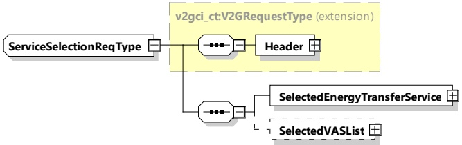

<table border=1 style='margin: auto; word-wrap: break-word;'><tr><td rowspan="2">ServiceParameterList</td><td style='text-align: center; word-wrap: break-word;'>complexType:</td><td rowspan="2">Includes the list of parameters for a specific serviceID received from the SECC in the ServiceDiscoveryRes message and for which additional information has been requested by the EVCC.</td></tr><tr><td style='text-align: center; word-wrap: break-word;'>ServiceParameterListType refer to 8.3.5.3.21</td></tr></table>

NOTE During the service selection process, EVCC and SECC negotiate the control mode for the charging session. The parameters to be exchanged are dependent on the selected control mode. For details on the scheduled and dynamic control modes see 8.4.2.

###### 8.3.4.3.6 ServiceSelectionReq/Res

####### 8.3.4.3.6.1 ServiceSelection handling

Based on the services provided by the SECC, this message pair allows the transmission of the selected services and related parameter sets.

####### 8.3.4.3.6.2 ServiceSelectionReq

This request message transports the information on the selected services.

VAS requirements are not fully defined yet and will be updated in the next version of this document. As such, the implementers should be careful about implementing VAS.

[V2G20-1252]

The EVCC and the SECC shall implement the message elements as defined in Table 42 and Figure 46.

Figure 46 — Schema diagram -ServiceSelectionReq

The elements of this message are used according to Table 42.

Table 42 — Semantics and type definition for ServiceSelectionReq

<table border=1 style='margin: auto; word-wrap: break-word;'><tr><td style='text-align: center; word-wrap: break-word;'>Element Name</td><td style='text-align: center; word-wrap: break-word;'>Type</td><td style='text-align: center; word-wrap: break-word;'>Semantics</td></tr><tr><td style='text-align: center; word-wrap: break-word;'>Header</td><td style='text-align: center; word-wrap: break-word;'>complexType:MessageHeaderTypeRefer to 8.3.3</td><td style='text-align: center; word-wrap: break-word;'>Contains general information, used for all messages.</td></tr><tr><td style='text-align: center; word-wrap: break-word;'>SelectedEnergyTransferService</td><td style='text-align: center; word-wrap: break-word;'>complexType:SelectedServiceTyperefer to 8.3.5.3.25</td><td style='text-align: center; word-wrap: break-word;'>Contains the selected charge or BPT service.</td></tr><tr><td style='text-align: center; word-wrap: break-word;'>SelectedVASList</td><td style='text-align: center; word-wrap: break-word;'>complexType:SelectedServiceListTyperefer to 8.3.5.3.24</td><td style='text-align: center; word-wrap: break-word;'>Optional:List contains all selected ServiceIDs and the ParameterSetIDs.</td></tr></table>

Copied with the permission of ANSI on behalf of ISO in connection with USDOT National Electric Vehicle Infrastructure (NEVI) Formula Program. Copying not permitted. ©ISO. All rights reserved.