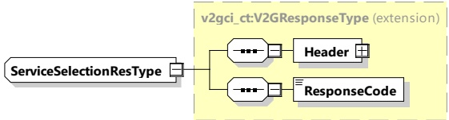

####### 8.3.4.3.6.3 ServiceSelectionRes

With this message the SECC informs the EVCC whether the selected services were accepted.

[V2G20-1253] The EVCC and the SECC shall implement the message elements as defined in Table 43 and Figure 47.

Figure 47 — Schema diagram - ServiceSelectionRes

The elements of this message are used according to Table 43.

Table 43 — Semantics and type definition for ServiceSelectionRes

<table border=1 style='margin: auto; word-wrap: break-word;'><tr><td style='text-align: center; word-wrap: break-word;'>Element Name</td><td style='text-align: center; word-wrap: break-word;'>Type</td><td style='text-align: center; word-wrap: break-word;'>Semantics</td></tr><tr><td style='text-align: center; word-wrap: break-word;'>Header</td><td style='text-align: center; word-wrap: break-word;'>complexType:MessageHeaderTypeRefer to 8.3.3</td><td style='text-align: center; word-wrap: break-word;'>Contains general information, used for all messages.</td></tr><tr><td style='text-align: center; word-wrap: break-word;'>ResponseCode</td><td style='text-align: center; word-wrap: break-word;'>simpleType:responseCodeTypeenumerationrefer to Annex A for the type definition</td><td style='text-align: center; word-wrap: break-word;'>ResponseCode indicating the acknowledgment status of any of the V2G messages received by the SECC.</td></tr></table>

###### 8.3.4.3.7 ScheduleExchangeReq/Res

####### 8.3.4.3.7.1 ScheduleExchangeReq/Res handling

After negotiating the energy transfer parameters with the ChargeParameterDiscovery message pair, the SECC provides information about the schedules, which the EVCC might restrict first.

Concepts treated for an optimal supply of energy that corresponds to the customer needs:

When using scheduled control mode, the energy transfer parameters negotiation that precedes the delivery of energy or may be engaged during the energy delivery phase is destined to ensure that the user will be satisfied while at the same time ensuring that the energy will effectively be available and fall within the capacity of power supply grid at the local level (private network) and at the regional level (public network). This required negotiation will become more and more necessary as the number of EVs increase, as well as an increase in volatility of local renewable energy production.

When using the dynamic control mode, the energy transfer parameters can be changed dynamically while in the charging loop, depending on the need of the EVSE.

Initially, before the onset of the energy supply, the EV will negotiate the power profile with the EVSE operator, and third party actors indirectly, to fit to the known or predicted available electric power. The