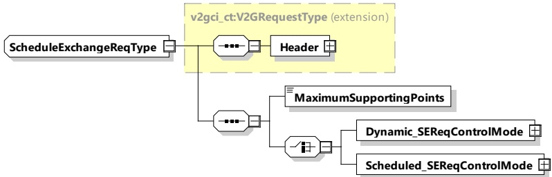

available energy may change once the energy transfer has started due to sudden lack of power source, or increase in demand of other consumptions (e.g. other EV arrival). A schedule renegotiation shall be allowed to cope with difficulties encountered, locally or regionally.

Such a schedule renegotiation is included within the communication protocol between EVSE and EV during the energy transfer period. Upper level systems, to be designed in the future, using this protocol, will manage to combine these functions in order to reach the optimum between satisfaction of user needs and other constraints.

####### 8.3.4.3.7.2 ScheduleExchangeReq

By sending the ScheduleExchangeReq message the EVCC provides its energy transfer parameters to the SECC. This message provides status information about the EV and additional energy transfer parameters, like estimated energy amounts for recharging the EV and the point in time the user intends to leave the EVSE.

[V2G20-1267] The EVCC and the SECC shall implement the message elements as defined in Table 44 and Figure 48.

[V2G20-2642] In case scheduled control mode was selected, if there is no DepartureTime information available, the EVCC shall not include this message element in the ScheduleExchangeReq message.

Figure 48 — Schema diagram - ScheduleExchangeReq

The elements of this message are used according to Table 44.

Table 44 — Semantics and type definition for ScheduleExchangeReq

<table border=1 style='margin: auto; word-wrap: break-word;'><tr><td style='text-align: center; word-wrap: break-word;'>Element Name</td><td style='text-align: center; word-wrap: break-word;'>Type</td><td style='text-align: center; word-wrap: break-word;'>Semantics</td></tr><tr><td style='text-align: center; word-wrap: break-word;'>Header</td><td style='text-align: center; word-wrap: break-word;'>complexType:MessageHeaderTypeRefer to 8.3.3</td><td style='text-align: center; word-wrap: break-word;'>Contains general information, used for all messages.</td></tr><tr><td style='text-align: center; word-wrap: break-word;'>MaximumSupportingPoints</td><td style='text-align: center; word-wrap: break-word;'>simpleType:maxSupportingPointsScheduleTupleTyperefer to Annex A for the type definition</td><td style='text-align: center; word-wrap: break-word;'>Indicates the maximal number of entries in the sub-elements of a ScheduleTuple, where it applies to all elements of PowerScheduleType and PriceRuleType.The SECC can transmit up to the maximum number of entries defined in this parameter.</td></tr></table>