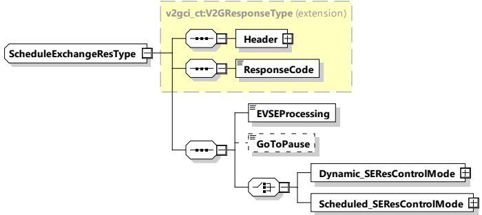

<table border=1 style='margin: auto; word-wrap: break-word;'><tr><td style='text-align: center; word-wrap: break-word;'>Dynamic_SEReqControlMode</td><td style='text-align: center; word-wrap: break-word;'>complexType:Dynamic_SEReqControlModeTyperefer to 8.3.5.3.13</td><td style='text-align: center; word-wrap: break-word;'>This element is used by the EVCC for initiating settings for the dynamic control mode.</td></tr><tr><td style='text-align: center; word-wrap: break-word;'>Scheduled_SEReqControlMode</td><td style='text-align: center; word-wrap: break-word;'>complexType:Scheduled_SEReqControlModeTyperefer to 8.3.5.3.14</td><td style='text-align: center; word-wrap: break-word;'>This element is used by the EVCC for initiating settings for the scheduled control mode.</td></tr></table>

[V2G20-2175] An EVCC shall set MaximumSupportingPoints to the maximum number of elements of PowerScheduleEntry, PriceRule and PriceLevelScheduleEntries it supports.

[V2G20-1056] The value MaximumSupportPoints shall not exceed 1024.

[V2G20-1201] If more than one ScheduleTuple containing PriceLevelSchedule is sent to the EV, they shall have the same NumberOfPriceLevels and priceLevels inside. Different ScheduleTupleless shall correspond to the same energy price level.

[V2G20-1202] An EVCC and an SECC shall support minimum 12 entries for PowerScheduleEntry, PriceRule and priceLevelScheduleEntries elements inside one ScheduleTuple.

[V2G20-1544] An SECC shall send no more than MaximumSupportingPoints entries for PowerScheduleEntry, PriceLevelScheduleEntries and PriceRule.

NOTE The parameters related to current, power and voltage provided in Schedule Exchange message pair can be considered as physical limitations, meaning that they are related to the physical abilities of the system under rated operating conditions. Later during the energy transfer process, depending on the external and environmental conditions (State of Charge (SOC), temperatures, etc.), the values of these limitations can change into more conservative values.

####### 8.3.4.3.7.3 ScheduleExchangeRes

With the ScheduleExchangeRes message the SECC provides applicable energy transfer parameters from the grid's perspective. Optionally, this also includes further information on cost over time, cost over demand, cost over consumption or a combination of these. The term cost refers to any kind of cost specified in this document and is not limited to monetary costs. Based on this cost information the EV may optimize its energy transfer schedule for the requested amount of energy.

NOTE 1 By "cost", the EVSE can stimulate - not force - the EV to transfer energy in periods where it is advantageous for the grid (e.g. because in these periods, a lot of wind-power is to be expected).

[V2G20-1259]

The EVCC and the SECC shall implement the message elements as defined in Table 45 and Figure 49.

