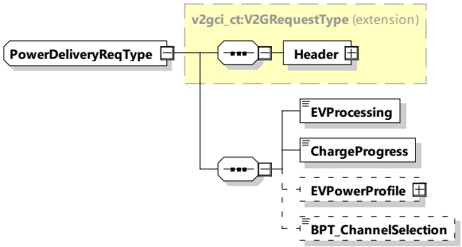

NOTE 3 V2G20-2123 implies that in case DC was selected as the energy transfer mode, the EVCC will skip DC_CableCheck and DC_PreCharge, similar to V2G20-2122.

###### 8.3.4.3.8 PowerDeliveryReq/Res

####### 8.3.4.3.8.1 PowerDeliveryReq/Res handling

The power delivery message exchange marks the point in time when the EVSE provides voltage to its output power outlet and the EV can start the power transfer.

[V2G20-1260] The value of the ScheduleTupleID element shall be equal to one of the values of the ScheduleTupleID elements (see 8.3.5.3.17) in the list of ScheduleTuple elements (see 8.3.5.3.15) provided in the ScheduleExchangeRes message (see 8.3.4.4.2.3).

[V2G20-1065] If the BPT service was selected in either AC or DC and the reverse power transfer system requires HLC-based control of switching electricity power channels, the parameter BPT_ChannelSelection of PowerDeliveryReq shall be applied.

8.3.4.3.8.2 PowerDeliveryReq

By sending the PowerDeliveryReq the EVCC requests the SECC to provide power. The EVCC also transmits the EVPowerProfile it will follow during the energy transfer process. Additionally, the EVCC can request the SECC to enter a standby or pause period.

NOTE 1 The point in time this message is sent does not necessarily correlate with the start of the energy transfer process. Based on the negotiated EVPowerProfile, the EV could request to start the power flow at a later point in time.

[V2G20-1068]

In scheduled control mode, any standby period initiated by the EVCC shall be indicated as zero power period in the currently applied EVPowerProfile, sent in the latest PowerDeliveryReq with ChargeProgress set to "Start", "Standby", "Stop" or "Pause".

A "zero power" period in an EVPowerProfile does not require a pause to be initiated. Only if a pause is requested by the EVCC shall the applied EVPowerProfile indicate this accordingly.

[V2G20-1261] The EVCC and the SECC shall implement the message elements as defined in Table 46 and Figure 50.

Figure 50 — Schema diagram - PowerDeliveryReq

The elements of this message are used according to Table 46.