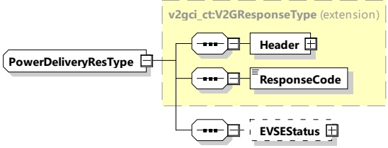

Figure 51 — Schema diagram - PowerDeliveryRes

The elements of this message are used according to Table 47.

Table 47 — Semantics and type definition for PowerDeliveryRes

<table border=1 style='margin: auto; word-wrap: break-word;'><tr><td style='text-align: center; word-wrap: break-word;'>Element Name</td><td style='text-align: center; word-wrap: break-word;'>Type</td><td style='text-align: center; word-wrap: break-word;'>Semantics</td></tr><tr><td style='text-align: center; word-wrap: break-word;'>Header</td><td style='text-align: center; word-wrap: break-word;'>complexType:MessageHeaderTypeRefer to 8.3.3</td><td style='text-align: center; word-wrap: break-word;'>Contains general information, used for all messages.</td></tr><tr><td style='text-align: center; word-wrap: break-word;'>ResponseCode</td><td style='text-align: center; word-wrap: break-word;'>simpleType:responseCodeTypeenumerationrefer to Annex A for the type definition</td><td style='text-align: center; word-wrap: break-word;'>ResponseCode indicating the acknowledgment status of any of the V2G messages received by the SECC.</td></tr><tr><td style='text-align: center; word-wrap: break-word;'>EVSEStatus</td><td style='text-align: center; word-wrap: break-word;'>complexType:EVSEStatusTyperefer to 8.3.5.3.26</td><td style='text-align: center; word-wrap: break-word;'>Optional:This element is used by the SECC for indicating the EVSE status and for signaling an event the SECC expects the EVCC to react to.</td></tr></table>

[V2G20-1070] The SECC shall always accept the EVPowerProfile of the EVCC (see 8.3.5.3.9) if it does not violate the rules of requirement [V2G20-1559].

[V2G20-1547] The EV shall adjust its nominal power level in such a way that it at no time exceeds the hard limits as defined by the boundaries of selected ChargingSchedule and — in BPT use cases — the DischargingSchedule. The EV shall ensure that required power ramp limitations are not violated during those adjustments. If the new limit for the power level is "zero", then the resulting active current flow shall be as close to "zero" as technically feasible. In cases where the EV violates any of those hard limits the EVSE may drop the EVs power connection and terminate the charging session.

NOTE 1 The definition of measurement tolerances is out of the scope for this document, but some more background and further references are provided in Annex I.

NOTE 2 For AC connections the defined "zero" rule only applies to the active power (Watt) component.

NOTE 3 For AC the power level is not the measured value but a calculated value based on the nominal voltage. Real implementations might prefer to watch ampere values instead.

###### 8.3.4.3.9 CertificateInstallationReq/Res

####### 8.3.4.3.9.1 CertificateInstallationReq/Res handling

Copied with the permission of ANSI on behalf of ISO in connection with USDOT National Electric Vehicle Infrastructure (NEVI) Formula Program. Copying not permitted. ©ISO. All rights reserved.