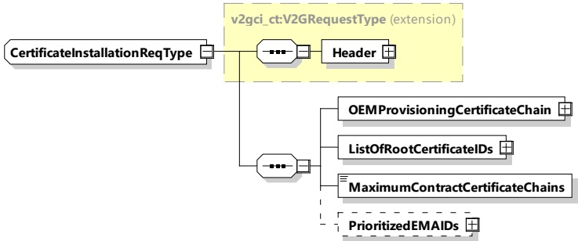

Unless specified otherwise, the OEM provisioning certificate and the respective key pair is used for this purpose.

NOTE 1 The EVCC provides the OEM provisioning certificate to the SECC, which then sends it to the SA. The SA uses this certificate to authenticate the EV, find contract certificates associated to this EV and encrypt these contract certificates with a key derived using the OEM provisioning certificate. Details of these steps can be found in the following clauses and in 7.9.2.5.

G20-1265] The EVCC and the SECC shall implement the message elements as defined in Table 48 and Figure 52.

Figure 52 — Schema diagram - CertificateInstallationReq

The elements of this message are used according to Table 48.

Table 48 — Semantics and type definition for CertificateInstallationReq

<table border=1 style='margin: auto; word-wrap: break-word;'><tr><td style='text-align: center; word-wrap: break-word;'>Element Name</td><td style='text-align: center; word-wrap: break-word;'>Type</td><td style='text-align: center; word-wrap: break-word;'>Semantics</td></tr><tr><td style='text-align: center; word-wrap: break-word;'>Header</td><td style='text-align: center; word-wrap: break-word;'>complexType:MessageHeaderTypeRefer to 8.3.3</td><td style='text-align: center; word-wrap: break-word;'>Contains general information, used for all messages.</td></tr><tr><td style='text-align: center; word-wrap: break-word;'>OEMProvisioningCertChain</td><td style='text-align: center; word-wrap: break-word;'>complexType:SignedCertificateChainTyperefer to 8.3.5.3.4</td><td style='text-align: center; word-wrap: break-word;'>An EV specific certificate chain, consisting of the OEM provisioning certificate and the OEM sub-CA certificates, that was earlier installed in the EVCC typically by an OEM. The ID of the OEM provisioning certificate (PCID), together with the information stored at the SA (contract partner), is used to identify the currently valid contracts of the EV.The certificates shall be DER encoded. Refer to ITU-T X 690 for details of DER encoding.NOTE 1 The OEM provisioning certificate itself (i.e. its public key) is used to encrypt the private key associated with the contract certificate in the CertificateInstallationRes later on.NOTE 2 The PCID can be given to the SA by the customer using a different communication channel. Please refer to H.1 and H.4 for further details.</td></tr><tr><td style='text-align: center; word-wrap: break-word;'>ListOfRootCertificateIDs</td><td style='text-align: center; word-wrap: break-word;'>complexType:</td><td style='text-align: center; word-wrap: break-word;'>This list contains the certificate IDs of all V2G root CA certificates currently installed in the</td></tr></table>