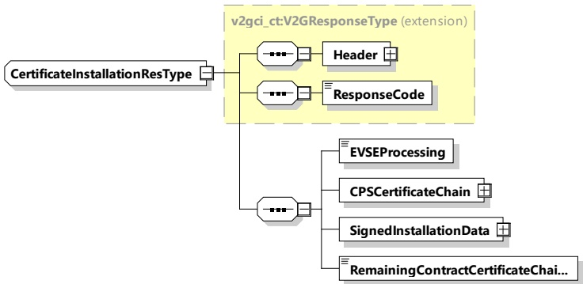

Figure 53 — Schema diagram - CertificateInstallationRes

The elements of this message are used according to Table 49.

Table 49 — Semantics and type definition for CertificateInstallationRes

<table border=1 style='margin: auto; word-wrap: break-word;'><tr><td style='text-align: center; word-wrap: break-word;'>Element Name</td><td style='text-align: center; word-wrap: break-word;'>Type</td><td style='text-align: center; word-wrap: break-word;'>Semantics</td></tr><tr><td style='text-align: center; word-wrap: break-word;'>Header</td><td style='text-align: center; word-wrap: break-word;'>complexType: MessageHeaderType Refer to 8.3.3</td><td style='text-align: center; word-wrap: break-word;'>Contains general information, used for all messages.</td></tr><tr><td style='text-align: center; word-wrap: break-word;'>ResponseCode</td><td style='text-align: center; word-wrap: break-word;'>simpleType: responseCodeType enumeration refer to Annex A for the type definition</td><td style='text-align: center; word-wrap: break-word;'>ResponseCode indicating the acknowledgment status of any of the V2G messages received by the SECC.</td></tr><tr><td style='text-align: center; word-wrap: break-word;'>EVSEProcessing</td><td style='text-align: center; word-wrap: break-word;'>simpleType: processingType enumeration refer to Annex A for the type definition</td><td style='text-align: center; word-wrap: break-word;'>Parameter value &quot;Finished&quot; indicates that the EVSE has finished the processing that was initiated after CertificateInstallationReq. Parameter value &quot;Ongoing&quot; indicates that the EVSE is still processing at the time when the response message was sent.</td></tr><tr><td style='text-align: center; word-wrap: break-word;'>CPSCertificateChain</td><td style='text-align: center; word-wrap: break-word;'>complexType: CertificateChainType refer to 8.3.5.3.3</td><td style='text-align: center; word-wrap: break-word;'>The transmitted certificate chain is used by the EVCC to verify the signature in the message header.</td></tr><tr><td style='text-align: center; word-wrap: break-word;'>SignedInstallationData</td><td style='text-align: center; word-wrap: break-word;'>complexType: SignedInstallationDataType refer to 8.3.5.3.39</td><td style='text-align: center; word-wrap: break-word;'>Includes all data to extract contract certificate and private key of contract certificate</td></tr><tr><td style='text-align: center; word-wrap: break-word;'>RemainingContractCertificateChains</td><td style='text-align: center; word-wrap: break-word;'>simpleType: xs:unsignedByte</td><td style='text-align: center; word-wrap: break-word;'>When larger than 0, additional contract certificate chains will be installed.</td></tr></table>

[V2G20-1552]

Upon receiving the first CertificateInstallationReq within a V2G communication session, the SECC shall set the value for the parameter