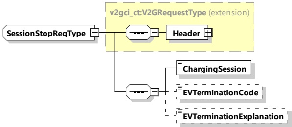

Figure 54 — Schema diagram - SessionStopReq

The elements of this message are used according to Table 50.

Table 50 — Semantics and type definition for SessionStopReq

<table border=1 style='margin: auto; word-wrap: break-word;'><tr><td style='text-align: center; word-wrap: break-word;'>Element Name</td><td style='text-align: center; word-wrap: break-word;'>Type</td><td style='text-align: center; word-wrap: break-word;'>Semantics</td></tr><tr><td style='text-align: center; word-wrap: break-word;'>Header</td><td style='text-align: center; word-wrap: break-word;'>complexType:MessageHeaderTypeRefer to 8.3.3</td><td style='text-align: center; word-wrap: break-word;'>Contains general information, used for all messages.</td></tr><tr><td style='text-align: center; word-wrap: break-word;'>ChargingSession</td><td style='text-align: center; word-wrap: break-word;'>simpleType:ChargingSessionTyperefer to Annex A for the type definition</td><td style='text-align: center; word-wrap: break-word;'>ChargingSession indicates the intention of the EVCC to either carry out a ServiceRenegotiation(&quot;ServiceRenegotiation&quot;), or to pause (&quot;Pause&quot;) or terminate(&quot;Terminate&quot;) a V2G communication session.</td></tr><tr><td style='text-align: center; word-wrap: break-word;'>EVTerminationCode</td><td style='text-align: center; word-wrap: break-word;'>simpleType:nameTyperefer to Annex A for the type definition</td><td style='text-align: center; word-wrap: break-word;'>Optional:A string in URN notation which shall uniquely identify the reason for termination.</td></tr><tr><td style='text-align: center; word-wrap: break-word;'>EVTerminationExplanation</td><td style='text-align: center; word-wrap: break-word;'>simpleType:descriptionTyperefer to Annex A for the type definition</td><td style='text-align: center; word-wrap: break-word;'>Optional:Indicates the reason for EV termination.</td></tr></table>

NOTE Future revisions of this document will introduce concrete EVTerminationCode values (e.g. urn:iso:std:iso:15118:-20:EVTerminationCode:ChargerConnectorLockFault). However other documents (e.g. IEC 61851-23) might also define similar codes which also can be expressed as URN values for the EVTerminationCode. The URN namespaces will prevent conflicts in the assigned values.

####### 8.3.4.3.10.3 SessionStopRes

After receiving the SessionStopReq of the EVCC the SECC sends the SessionStopRes informing the EVCC if terminating the energy transfer process was successful.

The EVCC and the SECC shall implement the message elements as defined in Table 51 and Figure 55.