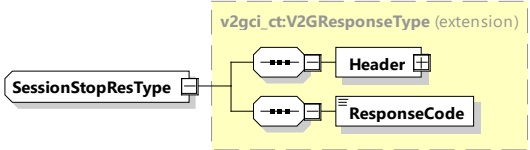

Figure 55 — Schema diagram - SessionStopRes

The elements of this message are used according to Table 51.

Table 51 — Semantics and type definition for SessionStopRes

<table border=1 style='margin: auto; word-wrap: break-word;'><tr><td style='text-align: center; word-wrap: break-word;'>Element Name</td><td style='text-align: center; word-wrap: break-word;'>Type</td><td style='text-align: center; word-wrap: break-word;'>Semantics</td></tr><tr><td style='text-align: center; word-wrap: break-word;'>Header</td><td style='text-align: center; word-wrap: break-word;'>complexType:MessageHeaderTypeRefer to 8.3.3</td><td style='text-align: center; word-wrap: break-word;'>Contains general information, used for all messages.</td></tr><tr><td style='text-align: center; word-wrap: break-word;'>ResponseCode</td><td style='text-align: center; word-wrap: break-word;'>simpleType:responseCodeTypeenumerationrefer to Annex A for the type definition</td><td style='text-align: center; word-wrap: break-word;'>ResponseCode indicating the acknowledgment status of any of the V2G messages received by the SECC.</td></tr></table>

[V2G20-1080] After confirming a SessionStopReq with ChargingSession set to "Terminate", by a SessionStopRes with ResponseCode set to "OK", the SECC shall discard all session related information such as session ID, selected charge service or authorization details.

NOTE If a session is terminated it cannot be resumed even if the physical connection has not been disconnected. Any following session can be considered as a new session, requiring a new session ID.

###### 8.3.4.3.11 MeteringConfirmationReq/Res

####### 8.3.4.3.11.1 MeteringConfirmationReq/Res handling

When sending a MeteringConfirmationReq message the EVCC acknowledges that the data elements SessionID, MeterInfo, receipt and the ScheduleTupleID included in the charge loop message prior to this request have been received from the SECC.

Since the EVCC needs to sign the data using the contract certificate's private key, also used for authorization of the services in the currently active V2G communication/service session, the EVCC can only provide this acknowledgement in case PnC is used as the authorization mode. The EVCC cannot provide this acknowledgement when EIM is used as the authorization service.

[V2G20-2704] MeteringConfirmation shall only be used when PnC was selected as the authorization mode during AuthorizationReq.

[V2G20-902] The element MeterInfo sent by the SECC in the message ChargeLoopRes shall be the amount of energy charged during the current service session.

NOTE 1 This would allow the EVCC in general to analyze the meter reading, if it wishes to do so.

[V2G20-1833] If the EVSE is equipped with metering technology and the capability to provide MeterInfo data is supported, then the SECC shall provide initial MeterInfo in the very