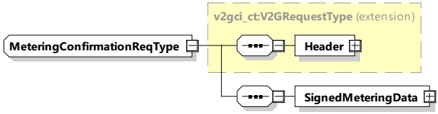

first charge loop response message. Alternatively, if the SECC knows that MeterInfo data shall be exchanged during an energy transfer session, then the SECC shall provide initial MeterInfo in the very first charge loop response message.

[V2G20-1081] If the EVCC wants to receive the MeterInfo element, the EVCC shall set the parameter MeterInfoRequested to TRUE in the ChargeLoopReq, depending on the charging services on V2GTP payload type EXI encoded V2G messages.

[V2G20-1082] If [V2G20-1081] applies, the SECC shall respond with the ChargeLoopRes including the MeterInfo element.

[V2G20-1083] If the SECC wants to trigger a MeteringConfirmationReq/Res, the SECC shall include the MeterInfo in its ChargeLoopRes and set the EVSENotification to MeteringConfirmation.

[V2G20-2105] If EVSENotification is set to MeteringConfirmation in the ChargeLoopRes, the SECC shall provide a NotificationMaxDelay value. The SECC shall not send another message with EVSENotification set to MeteringConfirmation until it either received a MeteringConfirmationReq or the timeout, which was announced in the NotificationMaxDelay, has been reached.

[V2G20-1084] If [V2G20-1083] applies, the EVCC shall send a MeteringConfirmationReq on V2GTP payload type MeteringConfirmationPayloadID.

[V2G20-1085] If [V2G20-1084] applies, the SECC shall respond with a MeteringConfirmationRes on V2GTP payload type MeteringConfirmationPayloadID.

NOTE 2 After the MeteringConfirmationRes on V2GTP payload type MeteringConfirmationPayloadID messages with ResponseCode = OK has been received by the EVCC, no further message exchange on V2GTP payload type MeteringConfirmationPayloadID messages is expected for this MeteringConfirmation exchange.

####### 8.3.4.3.11.2 MeteringConfirmationReq

[V2G20-1273] The EVCC and the SECC shall implement the message elements as defined in Table 52 and Figure 56.

Figure 56 — Schema diagram - MeteringConfirmationReq

The elements of this message are used according to Table 52.

Table 52 — Semantics and type definition for MeteringConfirmationReq

<table border=1 style='margin: auto; word-wrap: break-word;'><tr><td style='text-align: center; word-wrap: break-word;'>Element Name</td><td style='text-align: center; word-wrap: break-word;'>Type</td><td style='text-align: center; word-wrap: break-word;'>Semantics</td></tr><tr><td style='text-align: center; word-wrap: break-word;'>Header</td><td style='text-align: center; word-wrap: break-word;'>complexType:MessageHeaderTypeRefer to 8.3.3</td><td style='text-align: center; word-wrap: break-word;'>Contains general information, used for all messages.</td></tr></table>