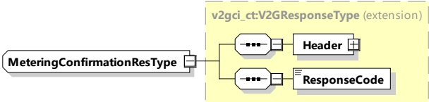

<table border=1 style='margin: auto; word-wrap: break-word;'><tr><td rowspan="3">SignedMeteringData</td><td style='text-align: center; word-wrap: break-word;'>complexType:</td><td rowspan="3">Includes all elements that need to be signed by the EVCC.</td></tr><tr><td style='text-align: center; word-wrap: break-word;'>SignedMeteringData</td></tr><tr><td style='text-align: center; word-wrap: break-word;'>refer to 8.3.5.3.36 for the type definition</td></tr></table>

[V2G20-776] The EVCC shall send the same value of SelectedScheduleTupleID, as it sent it in the PowerDeliveryReq.

[V2G20-2236] If the SECC provided a Receipt in the last ChargeLoopRes, the EVCC shall include this Receipt in the MeteringConfirmationReq.

[V2G20-1808] The EVCC shall sign the SignedMeteringData using the contract certificate's private key, which is also being used for authorization of the services in the currently active V2G communication/service session.

NOTE 1 The signature applied by the EVCC is intended only to confirm that the EVCC, together with the currently applied charging contract certificate, which was selected for this charging session, has received the data elements SessionID, MeterInfo, Receipt and the ScheduleTupleID included in the ChargeLoopRes message prior to this request. It is not intended to confirm that the amount of energy indicated in the previous MeterInfo is correct in the context of billing. However, the SignedMeteringData might be used by any eMSP for billing purposes in general. It is not in the scope of this document to define the billing process which is subject to local regulations.

[V2G20-904]

The SECC/SA may verify the signature of the SignedMeteringData element of the MeteringConfirmationReq message using the contract certificate it has received in AuthorizationReq. If this verification fails, the MeteringConfirmationReq shall be regarded as invalid.

NOTE 2 The SECC received the relevant contract certificate in the AuthorizationReq. The SECC accepted this contract certificate as an authorization method when it sent the AuthorizationRes for this AuthorizationReq with the ResponseCode starting with "OK".

NOTE 3 The SECC can submit the contract certificate to a secondary actor along with the signed SignedMeteringData, so that the secondary actor can later re-verify it. In case the secondary actor has stored the contract certificate already, an ID and the issuing CA for the contract certificate can suffice.

NOTE 4 It is possible that the EVCC is not able to verify the signature of MeterSignature, which was generated by the SECC and which is included in the MeterInfo element, e.g. because some data necessary for the signature is not transmitted. Therefore, the signature applied by the EVCC in this subclause only serves as an acknowledgement that the EVCC has seen this data and does not constitute any assertion of correctness.

####### 8.3.4.3.11.3 Metering ConfirmationRes

After receiving the MeteringConfirmationReq from the EVCC, the SECC sends the MeteringConfirmationRes informing the EVCC whether the signed data was successfully received and accepted by the SECC.

[V2G20-1274] The EVCC and the SECC shall implement the message elements as defined in Table 53 and Figure 57.

