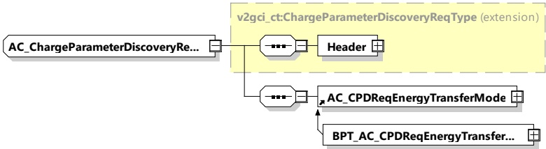

Figure 58 — Schema diagram - AC_ChargeParameterDiscoveryReq

The elements of this message are used according to Table 54.

Table 54 — Semantics and type definition for AC_ChargeParameterDiscoveryReq

<table border=1 style='margin: auto; word-wrap: break-word;'><tr><td style='text-align: center; word-wrap: break-word;'>Element Name</td><td style='text-align: center; word-wrap: break-word;'>Type</td><td style='text-align: center; word-wrap: break-word;'>Semantics</td></tr><tr><td style='text-align: center; word-wrap: break-word;'>Header</td><td style='text-align: center; word-wrap: break-word;'>complexType:MessageHeaderTypeRefer to 8.3.3</td><td style='text-align: center; word-wrap: break-word;'>Contains general information, used for all messages.</td></tr><tr><td style='text-align: center; word-wrap: break-word;'>AC_CPDReqEnergyTransferMode</td><td style='text-align: center; word-wrap: break-word;'>complexType:AC_CPDReqEnergyTransferModeTyperefer to 8.3.5.4.1</td><td style='text-align: center; word-wrap: break-word;'>This element is used by the EVCC for initiating the target setting process for AC energy transfer.</td></tr><tr><td style='text-align: center; word-wrap: break-word;'>BPT_AC_CPDReqEnergyTransferMode</td><td style='text-align: center; word-wrap: break-word;'>complexType:BPT_AC_CPDReqEnergyTransferModeTyperefer to 8.3.5.4.7.1</td><td style='text-align: center; word-wrap: break-word;'>This element is used by the EVCC for initiating the target setting process for AC bidirectional energy transfer.</td></tr></table>

NOTE The parameters related to current, power and voltage provided in AC_ChargeParameterDiscovery message pair can be considered as physical limitations, meaning that they are related to the physical abilities of the system under rated operating conditions. Later during the charging process, depending on the external and environmental conditions (SOC, temperatures, etc.), the values of these limitations can change into more conservative values.

####### 8.3.4.4.2.3 AC_ChargeParameterDiscoveryRes

With the AC_ChargeParameterDiscoveryRes message the SECC provides applicable charge parameters from the grid's perspective.

G20-1206] The EVCC and the SECC shall implement the message elements as defined in Table 55 and Figure 59.