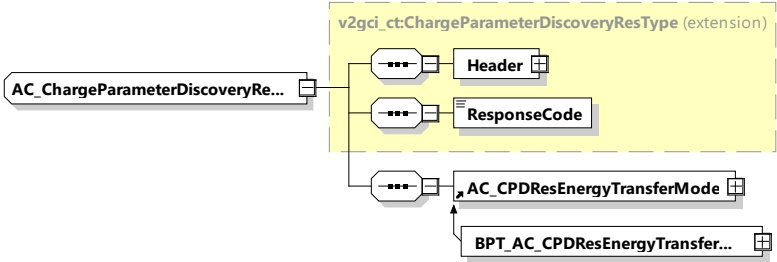

Figure 59 — Schema diagram - AC_ChargeParameterDiscoveryRes

The elements of this message are used according to Table 55.

Table 55 — Semantics and type definition for AC_ChargeParameterDiscoveryRes

<table border=1 style='margin: auto; word-wrap: break-word;'><tr><td style='text-align: center; word-wrap: break-word;'>Element Name</td><td style='text-align: center; word-wrap: break-word;'>Type</td><td style='text-align: center; word-wrap: break-word;'>Semantics</td></tr><tr><td style='text-align: center; word-wrap: break-word;'>Header</td><td style='text-align: center; word-wrap: break-word;'>complexType:MessageHeaderTyperefer to 8.3.3</td><td style='text-align: center; word-wrap: break-word;'>Contains general information, used for all messages.</td></tr><tr><td style='text-align: center; word-wrap: break-word;'>ResponseCode</td><td style='text-align: center; word-wrap: break-word;'>simpleType:responseCodeTypeenumerationrefer to Annex A for the type definition</td><td style='text-align: center; word-wrap: break-word;'>ResponseCode indicating the acknowledgment status of any of the V2G messages received by the SECC.</td></tr><tr><td style='text-align: center; word-wrap: break-word;'>AC_CPDResEnergyTransferMode</td><td style='text-align: center; word-wrap: break-word;'>complexType:AC_CPDResEnergyTransferModerefer to 8.3.5.4.2</td><td style='text-align: center; word-wrap: break-word;'>This element is used by the SECC for initiating the target setting process for AC energy transfer.</td></tr><tr><td style='text-align: center; word-wrap: break-word;'>BPT_AC_CPDResEnergyTransferMode</td><td style='text-align: center; word-wrap: break-word;'>complexType:BPT_AC_CPDResEnergyTransferModerefer to 8.3.5.4.7.2</td><td style='text-align: center; word-wrap: break-word;'>This element is used by the SECC for initiating the target setting process for AC bidirectional energy transfer.</td></tr></table>

###### 8.3.4.4.3 AC_ChargeLoopReq/Res

####### 8.3.4.4.3.1 AC_ChargeLoopReq/Res handling

The AC_ChargeLoop message pair provides continuous data exchange between SECC and EVCC. Additionally, it allows sanity checks on the meter readings provided by the SECC.

####### 8.3.4.4.3.2 AC_ChargeLoopReq

[V2G20-1277] The EVCC and the SECC shall implement the message elements as defined in Table 56 and Figure 60.