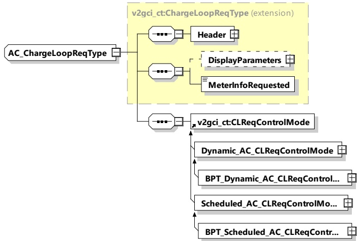

Figure 60 — Schema diagram - AC_ChargeLoopReq

The elements of this message are used according to Table 56.

Table 56 — Semantics and type definition for AC_ChargeLoopReq

<table border=1 style='margin: auto; word-wrap: break-word;'><tr><td style='text-align: center; word-wrap: break-word;'>Element Name</td><td style='text-align: center; word-wrap: break-word;'>Type</td><td style='text-align: center; word-wrap: break-word;'>Semantics</td></tr><tr><td style='text-align: center; word-wrap: break-word;'>Header</td><td style='text-align: center; word-wrap: break-word;'>complexType:MessageHeaderTyperefer to 8.3.3</td><td style='text-align: center; word-wrap: break-word;'>Contains general information, used for all messages.</td></tr><tr><td style='text-align: center; word-wrap: break-word;'>DisplayParameters</td><td style='text-align: center; word-wrap: break-word;'>complexType:DisplayParametersTyperefer to 8.3.5.3.28</td><td style='text-align: center; word-wrap: break-word;'>Optional:Parameters that may be displayed on the EVSE or any other user interface which is connected directly or indirectly to the EVSE. They shall under no circumstances influence the V2G communication session.</td></tr><tr><td style='text-align: center; word-wrap: break-word;'>MeterInfoRequested</td><td style='text-align: center; word-wrap: break-word;'>simpleType:xs:boolean</td><td style='text-align: center; word-wrap: break-word;'>When this parameter is set to true, the next AC_ChargeLoopRes shall include the MeterInfo.</td></tr><tr><td style='text-align: center; word-wrap: break-word;'>Dynamic_AC_CLReqControlMode</td><td style='text-align: center; word-wrap: break-word;'>complexType:Dynamic_AC_CLReqControlModeTyperefer to 8.3.5.4.3</td><td style='text-align: center; word-wrap: break-word;'>This element is used by the EVCC for offering and setting parameters for dynamic control mode energy transfer.</td></tr><tr><td style='text-align: center; word-wrap: break-word;'>BPT_Dynamic_AC_CLReqControlMode</td><td style='text-align: center; word-wrap: break-word;'>complexType:BPT_Dynamic_AC_CLReqControlModeTyperefer to 8.3.5.4.7.3</td><td style='text-align: center; word-wrap: break-word;'>This element is used by the EVCC for offering and setting parameters for dynamic control mode BPT.</td></tr></table>