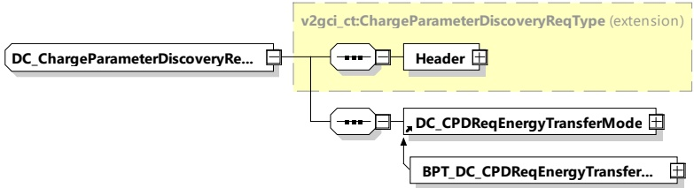

will be satisfied while at the same time ensuring that the energy will effectively be available and fall within the capacity of power supply grid at the local level (private network) and at the regional level (public network). This required negotiation will become more and more necessary as the number of EVs increase, as well as an increase in volatility of local renewable energy production.

When using the dynamic control mode, the energy transfer parameters can be changed dynamically while in the charging loop, depending on the need of the EV supply equipment.

####### 8.3.4.5.2.2 DC_ChargeParameterDiscoveryReq

By sending the DC_ChargeParameterDiscoveryReq message the EVCC provides its energy transfer parameters to the SECC. This message provides status information about the EV, i.e. the capabilities of the EV charging system.

[V2G20-1268] The EVCC and the SECC shall implement the message elements as defined in Table 58 and Figure 62.

Figure 62 — Schema diagram - DC_ChargeParameterDiscoveryReq

The elements of this message are used according to Table 58.

Table 58 — Semantics and type definition for DC_ChargeParameterDiscoveryReq

<table border=1 style='margin: auto; word-wrap: break-word;'><tr><td style='text-align: center; word-wrap: break-word;'>Element Name</td><td style='text-align: center; word-wrap: break-word;'>Type</td><td style='text-align: center; word-wrap: break-word;'>Semantics</td></tr><tr><td style='text-align: center; word-wrap: break-word;'>Header</td><td style='text-align: center; word-wrap: break-word;'>complexType:MessageHeaderTyperefer to 8.3.3</td><td style='text-align: center; word-wrap: break-word;'>Contains general information, used for all messages.</td></tr><tr><td style='text-align: center; word-wrap: break-word;'>DC_CPDReqEnergyTransferMode</td><td style='text-align: center; word-wrap: break-word;'>complexType:DC_CPDReqEnergyTransferModeTyperefer to 8.3.5.5.1</td><td style='text-align: center; word-wrap: break-word;'>This element is used by the EVCC for initiating the target setting process for DC charging.</td></tr><tr><td style='text-align: center; word-wrap: break-word;'>BPT_DC_CPDReqEnergyTransferMode</td><td style='text-align: center; word-wrap: break-word;'>complexType:BPT_DC_CPDReqEnergyTransferModeTyperefer to 8.3.5.5.7.1</td><td style='text-align: center; word-wrap: break-word;'>This element is used by the EVCC for initiating the target setting process for DC bidirectional charging.</td></tr></table>

NOTE The parameters related to current, power and voltage provided in DC_ChargeParameterDiscovery message pair can be considered as physical limitations, meaning that they are related to the physical abilities of the system under rated operating conditions. Later during the charging process, depending on the external and environmental conditions (SOC, temperatures, etc.), the values of these limitations can change into more conservative values.

####### 8.3.4.5.2.3 DC_ChargeParameterDiscoveryRes

Copied with the permission of ANSI on behalf of ISO in connection with USDOT National Electric Vehicle Infrastructure (NEVI) Formula Program. Copying not permitted. ©ISO. All rights reserved.