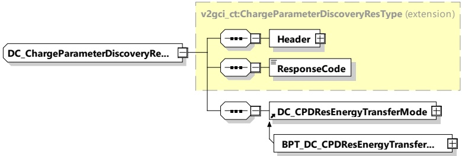

With the DC_ChargeParameterDiscoveryRes message the SECC provides applicable charge parameters from the grid's perspective.

[V2G20-1207] The EVCC and the SECC shall implement the message elements as defined in Table 59 and Figure 63.

Figure 63 — Schema diagram - DC_ChargeParameterDiscoveryRes

The elements of this message are used according to Table 59.

Table 59 — Semantics and type definition for DC_ChargeParameterDiscoveryRes

<table border=1 style='margin: auto; word-wrap: break-word;'><tr><td style='text-align: center; word-wrap: break-word;'>Element Name</td><td style='text-align: center; word-wrap: break-word;'>Type</td><td style='text-align: center; word-wrap: break-word;'>Semantics</td></tr><tr><td style='text-align: center; word-wrap: break-word;'>Header</td><td style='text-align: center; word-wrap: break-word;'>complexType:MessageHeaderTyperefer to 8.3.3</td><td style='text-align: center; word-wrap: break-word;'>Contains general information, used for all messages.</td></tr><tr><td style='text-align: center; word-wrap: break-word;'>ResponseCode</td><td style='text-align: center; word-wrap: break-word;'>simpleType:responseCodeTypeenumerationrefer to Annex A for the type definition</td><td style='text-align: center; word-wrap: break-word;'>ResponseCode indicating the acknowledgment status of any of the V2G messages received by the SECC.</td></tr><tr><td style='text-align: center; word-wrap: break-word;'>DC_CPDResEnergyTransferMode</td><td style='text-align: center; word-wrap: break-word;'>complexType:DC_CPDResEnergyTransferModeTyperefer to 8.3.5.5.2</td><td style='text-align: center; word-wrap: break-word;'>This element is used by the SECC for initiating the target setting process for DC charging.</td></tr><tr><td style='text-align: center; word-wrap: break-word;'>BPT_DC_CPDResEnergyTransferMode</td><td style='text-align: center; word-wrap: break-word;'>complexType:BPT_DC_CPDResEnergyTransferModeTyperefer to 8.3.5.5.7.2</td><td style='text-align: center; word-wrap: break-word;'>This element is used by the SECC for initiating the target setting process for DC bidirectional charging.</td></tr></table>

###### 8.3.4.5.3 DC CableCheckReq/Res

####### 8.3.4.5.3.1 DC_CableCheckReq/Res handling

[V2G20-1557] To ensure safety in DC energy transfer, a cable check shall be performed.

####### 8.3.4.5.3.2 DC CableCheckReq

The DC_CableCheckReq asks for the cable check status of the EVSE and, for example, tells the EVSE if the connector is locked on EV side and if the EV is ready to transfer energy.