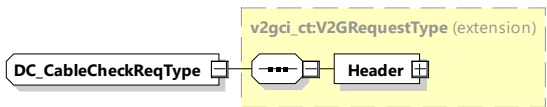
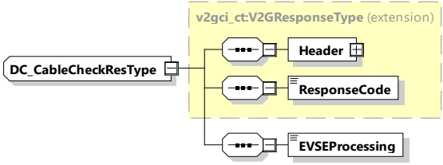

[V2G20-1279] The EVCC and the SECC shall implement the message elements as defined in Table 60 and Figure 64.

Figure 64 — Schema diagram - DC_CableCheckReq

The element of this message is used according to Table 60.

Table 60 — Semantics and type definition for DC_CableCheckReq

<table border=1 style='margin: auto; word-wrap: break-word;'><tr><td style='text-align: center; word-wrap: break-word;'>Element Name</td><td style='text-align: center; word-wrap: break-word;'>Type</td><td style='text-align: center; word-wrap: break-word;'>Semantics</td></tr><tr><td style='text-align: center; word-wrap: break-word;'>Header</td><td style='text-align: center; word-wrap: break-word;'>complexType:MessageHeaderTyperefer to 8.3.3</td><td style='text-align: center; word-wrap: break-word;'>Contains general information, used for all messages.</td></tr></table>

NOTE DC_CableCheckReq contains no elements

####### 8.3.4.5.3.3 DC CableCheckRes

After receiving the DC_CableCheckReq from the EVCC the SECC sends the DC_CableCheckRes informing the EVCC about the result of the cable check and EVSE status.

[V2G20-1280]

The EVCC and the SECC shall implement the message elements as defined in Table 61 and Figure 65.

Figure 65 — Schema diagram - DC_CableCheckRes

The elements of this message are used according to Table 61.

Table 61 — Semantics and type definition for DC_CableCheckRes

<table border=1 style='margin: auto; word-wrap: break-word;'><tr><td style='text-align: center; word-wrap: break-word;'>Element Name</td><td style='text-align: center; word-wrap: break-word;'>Type</td><td style='text-align: center; word-wrap: break-word;'>Semantics</td></tr><tr><td style='text-align: center; word-wrap: break-word;'>Header</td><td style='text-align: center; word-wrap: break-word;'>complexType:MessageHeaderTyperefer to 8.3.3</td><td style='text-align: center; word-wrap: break-word;'>Contains general information, used for all messages.</td></tr><tr><td style='text-align: center; word-wrap: break-word;'>ResponseCode</td><td style='text-align: center; word-wrap: break-word;'>simpleType:responseCodeTypeenumerationrefer to Annex A for the type definition</td><td style='text-align: center; word-wrap: break-word;'>ResponseCode indicating the acknowledgment status of any of the V2G messages received by the SECC.</td></tr></table>