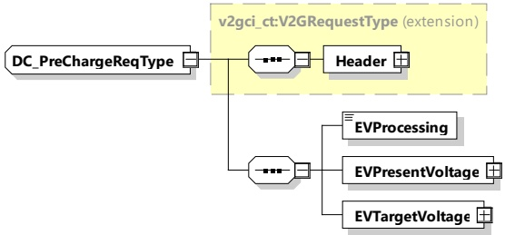

<table border=1 style='margin: auto; word-wrap: break-word;'><tr><td rowspan="2">EVSEProcessing</td><td style='text-align: center; word-wrap: break-word;'>simpleType: processingType</td><td rowspan="2">Parameter indicating that the EVSE has finished the processing that was initiated after the DC_CableCheckReq or if the EVSE is still processing at the time, the response message was sent.</td></tr><tr><td style='text-align: center; word-wrap: break-word;'>enumeration refer to Annex A for the type definition</td></tr></table>

NOTE By using the EVSEProcessing parameter, the EVSE can indicate to the EVCC that the processing is not finished but a response message is sent to fulfil the timeout and performance requirements defined in 8.5.4. This allows continuing the communication session while fulfilling the performance and timeout requirements.

###### 8.3.4.5.4 DC_PreChargeReq/Res

####### 8.3.4.5.4.1 DC_PreChargeReq/Res handling

PreCharge is used for adjusting the EVSE output voltage to the EV battery voltage.

####### 8.3.4.5.4.2 DC_PreChargeReq

The DC_PreChargeReq is used to start the Pre Charge process from EV side.

[V2G20-1281] The EVCC and the SECC shall implement the message elements as defined in Table 62 and Figure 66.

Figure 66 — Schema diagram - DC_PreChargeReq

The elements of this message are used according to Table 62.