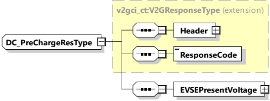

Table 62 — Semantics and type definition for DC_PreChargeReq

<table border=1 style='margin: auto; word-wrap: break-word;'><tr><td style='text-align: center; word-wrap: break-word;'>Element Name</td><td style='text-align: center; word-wrap: break-word;'>Type</td><td style='text-align: center; word-wrap: break-word;'>Semantics</td></tr><tr><td style='text-align: center; word-wrap: break-word;'>Header</td><td style='text-align: center; word-wrap: break-word;'>complexType:MessageHeaderTyperefer to 8.3.3</td><td style='text-align: center; word-wrap: break-word;'>Contains general information, used for all messages.</td></tr><tr><td style='text-align: center; word-wrap: break-word;'>EVProcessing</td><td style='text-align: center; word-wrap: break-word;'>simpleType:processingTypeenumerationrefer to Annex A for the type definition</td><td style='text-align: center; word-wrap: break-word;'>Parameter that indicates the stop of the DC_PreCharge process by the EV. When the EV wants to continue in the Sequence, the EVProcessing is set to &quot;Finished&quot;, while still running it is set to &quot;Ongoing&quot;.</td></tr><tr><td style='text-align: center; word-wrap: break-word;'>EVPresentVoltage</td><td style='text-align: center; word-wrap: break-word;'>complexType:RationalNumberTyperefer to 8.3.5.3.8</td><td style='text-align: center; word-wrap: break-word;'>Present voltage of the EV</td></tr><tr><td style='text-align: center; word-wrap: break-word;'>EVTargetVoltage</td><td style='text-align: center; word-wrap: break-word;'>complexTypeRationalNumberTyperefer to 8.3.5.3.8</td><td style='text-align: center; word-wrap: break-word;'>Target voltage of the EV (see 8.3.4.5.5.2 for more background)</td></tr></table>

The SECC shall adjust the voltage on the EVSE side, which is reported in the EVSEPresentVoltage element within the DC_PreChargeRes, to match the EVTargetVoltage as closely as necessary (for details see IEC 61851-23) in order to allow the contactors to close and to exit the PreCharge phase.

####### 8.3.4.5.4.3 DC_PreChargeRes

After receiving the DC_PreChargeReq from the EVCC the SECC sends the DC_PreChargeRes informing the EV about the EVSE status and the present EVSE output voltage.

[V2G20-1282] The EVCC and the SECC shall implement the message elements as defined in Table 63 and Figure 67.

Figure 67 — Schema diagram - DC_PreChargeRes

The elements of this message are used according to Table 63.

Table 63 — Semantics and type definition for DC_PreChargeRes

<table border=1 style='margin: auto; word-wrap: break-word;'><tr><td style='text-align: center; word-wrap: break-word;'>Element Name</td><td style='text-align: center; word-wrap: break-word;'>Type</td><td style='text-align: center; word-wrap: break-word;'>Semantics</td></tr><tr><td style='text-align: center; word-wrap: break-word;'>Header</td><td style='text-align: center; word-wrap: break-word;'>complexType:MessageHeaderTyperefer to 8.3.3</td><td style='text-align: center; word-wrap: break-word;'>Contains general information, used for all messages.</td></tr></table>