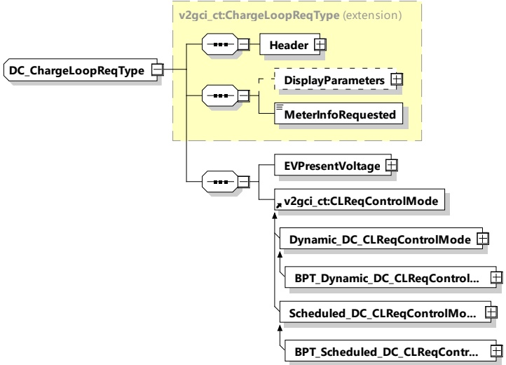

<table border=1 style='margin: auto; word-wrap: break-word;'><tr><td style='text-align: center; word-wrap: break-word;'>ResponseCode</td><td style='text-align: center; word-wrap: break-word;'>simpleType: responseCodeType enumeration refer to Annex A for the type definition</td><td style='text-align: center; word-wrap: break-word;'>ResponseCode indicating the acknowledgment status of any of the V2G messages received by the SECC.</td></tr><tr><td style='text-align: center; word-wrap: break-word;'>EVSEPresentVoltage</td><td style='text-align: center; word-wrap: break-word;'>complexType RationalNumberType refer to 8.3.5.3.8</td><td style='text-align: center; word-wrap: break-word;'>Present voltage as measured by the EVSE</td></tr></table>

###### 8.3.4.5.5 DC_ChargeLoopReq/Res

####### 8.3.4.5.5.1 DC_ChargeLoopReq/Res handling

For DC charging control cyclic exchange of the requested current from EV side is necessary. Also, the target voltage and the difference in current and voltages is transferred.

####### 8.3.4.5.5.2 DC_ChargeLoopReq

By sending the DC_ChargeLoopReq the EV requests a certain current from the EVSE. Also, the target voltage, current and voltage difference are transferred.

[V2G20-1283]

The EVCC and the SECC shall implement the message elements as defined in Table 64 and Figure 68.

Figure 68 — Schema diagram - DC_ChargeLoopReq

The elements of this message are used according to Table 64.

Table 64 — Semantics and type definition for DC_ChargeLoopReq

