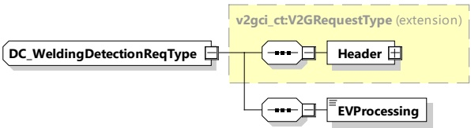

[V2G20-1275] In case EVCC selects the dynamic control mode with the service parameter MobilityNeedsMode set to "2", the SECC shall send a departure time in DC_ChargeLoopRes if it intends to update the DepartureTime sent in the latest ScheduleExchangeRes message.

[V2G20-2654] The absolute value of the following elements, if provided within any DC energy transfer control loop message, shall be less than or equal to the absolute value of the same element provided earlier in the DC_ChargeParameterDiscovery message pair:

– EVSEMaximumChargeCurrent

– EVSEMaximumDischargeCurrent

– EVSEMaximumVoltage

– EVSEMaximumChargePower

– EVSEMaximumDischargePower

## [V2G20-2655]

The absolute value of the following elements, if provided within any DC energy transfer control loop message, shall be higher than or equal to the absolute value of the same element provided earlier in the DC_ChargeParameterDiscovery message pair:

– EVSEMinimumChargeCurrent

– EVSEMinimumDischargeCurrent

– EVSEMinimumVoltage

– EVSEMinimumChargePower

– EVSEMinimumDischargePower

###### 8.3.4.5.6 DC_WeldingDetectionReq/Res

####### 8.3.4.5.6.1 DC_WeldingDetectionReq/Res handling

The Welding Detection messages described in this subclause allow to implement the Welding Detection mechanism according to IEC 61851-23.

####### 8.3.4.5.6.2 DC_WeldingDetectionReq

By sending the DC_WeldingDetectionReq the EV requests welding detection on EVSE side.

[V2G20-1285] The EVCC and the SECC shall implement the message elements as defined in Table 66 and Figure 70.

Figure 70 — Schema diagram - DC_WeldingDetectionReq

The elements of this message are used according to Table 66.