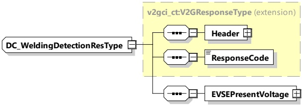

Table 66 — Semantics and type definition for DC_WeldingDetectionReq

<table border=1 style='margin: auto; word-wrap: break-word;'><tr><td style='text-align: center; word-wrap: break-word;'>Element Name</td><td style='text-align: center; word-wrap: break-word;'>Type</td><td style='text-align: center; word-wrap: break-word;'>Semantics</td></tr><tr><td style='text-align: center; word-wrap: break-word;'>Header</td><td style='text-align: center; word-wrap: break-word;'>complexType:MessageHeaderTyperefer to 8.3.3</td><td style='text-align: center; word-wrap: break-word;'>Contains general information, used for all messages.</td></tr><tr><td style='text-align: center; word-wrap: break-word;'>EVProcessing</td><td style='text-align: center; word-wrap: break-word;'>simpleType:processingTypeenumerationrefer to Annex A for the type definition</td><td style='text-align: center; word-wrap: break-word;'>Parameter that indicates the stop of the DC_WeldingDetection process by the EV. When the EV wants to continue in the Sequence, the EVProcessing is set to &quot;Finished&quot;, while still running it is set to &quot;Ongoing&quot;.</td></tr></table>

####### 8.3.4.5.6.3 DC_WeldingDetectionRes

After receiving the DC_WeldingDetectionReq from the EVCC, the SECC sends the Welding Detection Response informing the EV about the EVSE status and the present EVSE output voltage.

[V2G20-1286] The EVCC and the SECC shall implement the message elements as defined in Table 67 and Figure 71.

Figure 71 — Schema diagram - DC_WeldingDetectionRes

The elements of this message are used according to Table 67.

Table 67 — Semantics and type definition for DC_WeldingDetectionRes

<table border=1 style='margin: auto; word-wrap: break-word;'><tr><td style='text-align: center; word-wrap: break-word;'>Element Name</td><td style='text-align: center; word-wrap: break-word;'>Type</td><td style='text-align: center; word-wrap: break-word;'>Semantics</td></tr><tr><td style='text-align: center; word-wrap: break-word;'>Header</td><td style='text-align: center; word-wrap: break-word;'>complexType:MessageHeaderTypeRefer to 8.3.3</td><td style='text-align: center; word-wrap: break-word;'>Contains general information, used for all messages.</td></tr><tr><td style='text-align: center; word-wrap: break-word;'>ResponseCode</td><td style='text-align: center; word-wrap: break-word;'>simpleType:responseCodeTypeenumerationrefer to Annex A for the type definition</td><td style='text-align: center; word-wrap: break-word;'>ResponseCode indicating the acknowledgment status of any of the V2G messages received by the SECC.</td></tr><tr><td style='text-align: center; word-wrap: break-word;'>EVSEPresentVoltage</td><td style='text-align: center; word-wrap: break-word;'>complexTypeRationalNumberTyperefer to 8.3.5.3.8</td><td style='text-align: center; word-wrap: break-word;'>Present voltage as measured by the EVSE</td></tr></table>

##### 8.3.4.6 WPT messages

###### 8.3.4.6.1 Overview