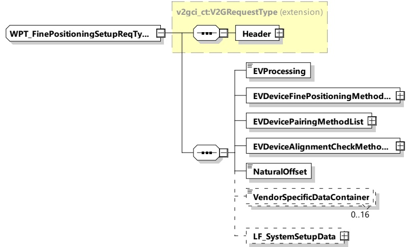

Messages defined as WPT-Messages belong to the WPT message set(s).

###### 8.3.4.6.2 WPT_FinePositioningSetupReq/Res

WPT_FinePositioningSetupReq/Res are used to exchange system setup data between the EVCC and SECC describing the individual positioning system characteristics at the EV device and at the supply device. Additionally, possibilities for the pairing and alignment check methods are exchanged and determined.

####### 8.3.4.6.2.1 WPT_FinePositioningSetupReq/Res handling

After SessionSetup has been done the EVCC sends a WPT_FinePositioningSetupReq in order to determine the possible options of the SECC for fine positioning, pairing and alignment check support. With the WPT_FinePositioningReq the EVCC will inform the SECC about its possible options.

The SECC responds to the request with a WPT_FinePositioningSetupRes containing information about available options with respect to fine positioning, pairing, and alignment check.

After analyzing the available options, the EVCC sends a WPT_FinePositioningSetupReq containing information about the choice for fine position, pairing and alignment check made by the EV.

The SECC responds with a confirmation of the EV's choice in the WPT_FinePositioningSetupRes.

####### 8.3.4.6.2.2 WPT_FinePositioningSetupReq

By sending the WPT_FinePositioningSetupReq message the EVCC provides its WPT_Fine positioning setup parameters to the SECC.

[V2G20-5009]

The EVCC and the SECC shall implement the message elements as defined in Figure 72 and Table 68.

Figure 72 — Schema diagram - WPT_FinePositioningSetupReq

The elements of this message are used according to Table 68.

Copied with the permission of ANSI on behalf of ISO in connection with USDOT National Electric Vehicle Infrastructure (NEVI) Formula Program. Copying not permitted. ©ISO. All rights reserved.