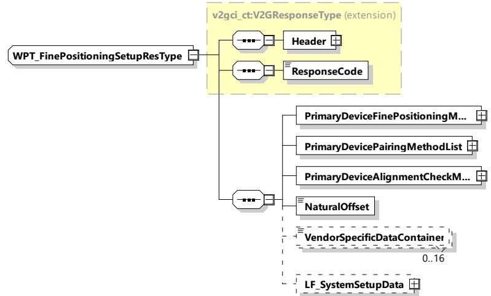

[V2G20-5001] As long as EVProcessing is set to "Ongoing" the lists "EVDeviceFinePositioningMethodList", "EVDevicePairingMethodList", "EVDeviceAlignmentCheckMethodList" shall contain more than one element.

[V2G20-5002] If the lists "EVDeviceFinePositioningMethodList", "EVDevicePairingMethodList", "EVDeviceAlignmentCheckMethodList" contain more than one element, the default values shall be part of the list, if the device is a compatibility class A device (see IEC 61980-2 and IEC 61980-3).

[V2G20-5003] If the EVProcessing is set to "Finished", the lists shall contain only one element which represents the EV's choice.

NOTE 1 The value of this element does not need to be the default value.

####### 8.3.4.6.2.3 WPT_FinePositioningSetupRes

With the WPT_FinePositioningSetupRes message the SECC provides information about possible methods for fine positioning, pairing and alignment check together with setup parameters, accordingly.

[V2622] defined in

Figure 73 — Schema diagram - WPT_FinePositioningSetupRes

The elements of this message are used according to Table 69.

Table 69 — Semantics and type definition for WPT_FinePositioningSetupRes

<table border=1 style='margin: auto; word-wrap: break-word;'><tr><td style='text-align: center; word-wrap: break-word;'>Element Name</td><td style='text-align: center; word-wrap: break-word;'>Type</td><td style='text-align: center; word-wrap: break-word;'>Semantics</td></tr><tr><td style='text-align: center; word-wrap: break-word;'>Header</td><td style='text-align: center; word-wrap: break-word;'>complexType:MessageHeaderTyperefer to 8.3.3</td><td style='text-align: center; word-wrap: break-word;'>Contains general information, used for all messages.</td></tr></table>