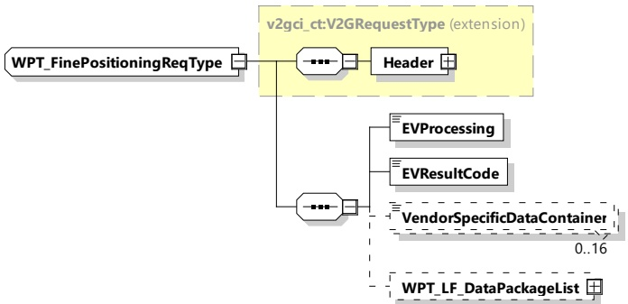

contain more than one element, the default values shall be part of the list, if the device is a compatibility class A device (See IEC 61980-2 and IEC 61980-3).

## [V2G20-5006]

When the SECC has received a FinePositioningSetupReq with the EVProcessing set to "Finished", the lists "PrimaryDeviceFinePositioningMethodList", "PrimaryDevicePairingMethodList", "PrimaryDeviceAlignmentCheckMethodList" shall contain only one element which confirm the EV's choice.

NOTE The value of this element does not need to be the default value.

###### 8.3.4.6.3 WPT Fine Positioning

####### 8.3.4.6.3.1 WPT_FinePositioningReq/Res handling

The fine positioning process is started by the EVCC by sending the WPT_FinePositioningSetupReq message. The SECC responds by sending the WPT_FinePositioningSetupRes message.

After this initialization the positioning procedure is continued by looping the WPT_FinePositioningReq/Res message. As long as the vehicle positioning process is not finished the SECC sets the parameter "EVSEProcessing" in the WPT_FinePositioningRes message to "Processing" and the EVCC repeatedly sends the WPT_FinePositioningReq message. The EVCC stops sending WPT_FinePositioningReq when the parameter "EVSEProcessing" in the WPT_FinePositioningRes message is set to "Finished".

####### 8.3.4.6.3.2 WPT_FinePositioningReq

[V2G20-5011] The EVCC and the SECC shall implement the message elements as defined in Figure 74 and Table 70.

Figure 74 — Schema diagram - WPT_FinePositioningReq

The elements of this message are used according to Table 70.

Table 70 — Semantics and type definition for WPT_FinePositioningReq

<table border=1 style='margin: auto; word-wrap: break-word;'><tr><td style='text-align: center; word-wrap: break-word;'>Element Name</td><td style='text-align: center; word-wrap: break-word;'>Type</td><td style='text-align: center; word-wrap: break-word;'>Semantics</td></tr><tr><td style='text-align: center; word-wrap: break-word;'>Header</td><td style='text-align: center; word-wrap: break-word;'>complexType:MessageHeaderTypeRefer to 8.3.3</td><td style='text-align: center; word-wrap: break-word;'>Contains general information, used for all messages.</td></tr></table>